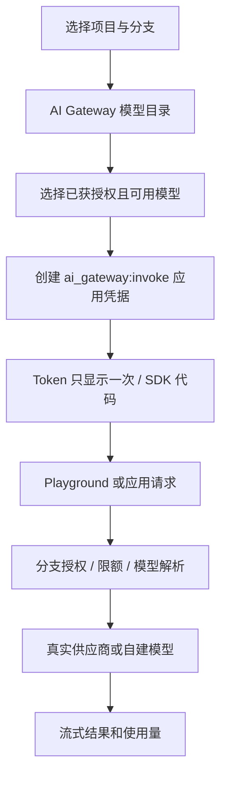
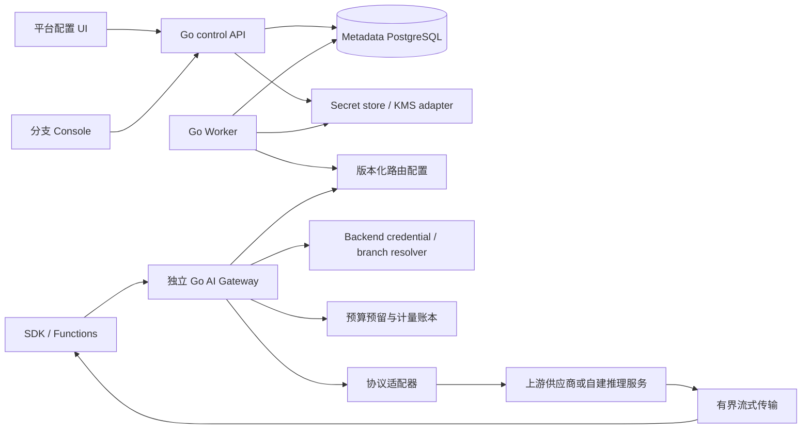
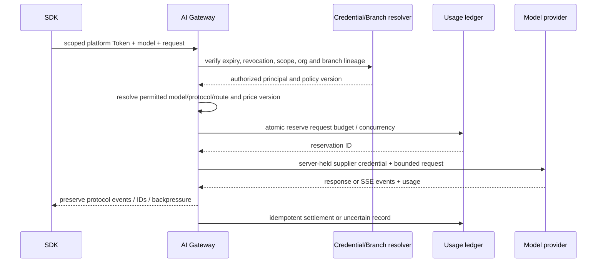

# AI Gateway 平台设计与官网对标核验

## 1. 结论和实施状态

**平台应支持 UI 配置上游、选择模型、创建应用凭据和查看用量。普通用户的默认体验应对齐 Neon：统一分支入口、统一平台凭据、多模型目录。**

此前要求提供 Kubernetes Secret 的名称，是当前尚未实现配置 UI 时的运维接入方式。
它不应成为产品用户的长期操作步骤。平台管理员应能在受保护的 UI 中录入、测试、轮换供应商密钥；
普通项目用户在模型目录和 Playground 选择模型，应用只使用平台凭据。

本文件主要是**演进合同**。分支应用凭据管理、权限检查及 UI 已有实现，实际接口以
[凭据手册](BACKEND-CREDENTIALS.md)和 OpenAPI 为准。`ai_gateway` 仍未实现推理服务，
没有已配置的模型供应商凭据；已有 Data API 代码与它分属不同服务。
下文尚未实现的供应商、模型目录、计量和推理 API 不应提前添加为可用路由或 capability。

### 核验依据

2026-10-04 阅读已下载官网仓库 `website`，提交
`c0d49cbb6979b2ce79ea502d62dbc40780a923b0`：

| 本地官网文档 | 核验内容 |
|---|---|
| `content/docs/ai-gateway/overview.md`，更新 2026-09-17 | 统一凭据、分支入口、模型访问及预付费 |
| `authentication.md`，更新 2026-09-17 | Console 创建凭据、`ai_gateway:invoke`、分支及后代授权、轮换撤销 |
| `get-started.md` | SDK 的 baseURL/apiKey、Console/CLI 配置流程 |
| `models.md`，更新 2026-09-17 | Databricks 托管、模型目录、协议路由、模型可用性 |
| `prepaid-credits.md` | 组织管理员购入额度、计量后的扣费和负余额可能性 |
| `chat-completions.md`、`openai-responses.md`、`anthropic-messages.md`、`gemini.md` | 协议差异、流式、模型与协议匹配 |
| `troubleshooting.md` | 凭据、作用域、分支、模型权限及限额错误 |

同时核验官网当前公开说明：
[LLMs belong in your backend](https://neon.com/blog/llms-belong-in-your-backend)、
[Backend GA](https://neon.com/blog/neon-backend-is-ga)、
[2026-10-02 Embeddings 更新](https://neon.com/blog/generate-embeddings-with-neon-ai-gateway)。
浏览工具不能处理部分 Docs 的 `text/markdown` 返回，随后通过 HTTPS 直接读取官方 `.md` 页面，
8 个公开资源均返回 200；保存正文、UTC 抓取时间和 SHA-256，未使用任何账号或模型凭据。
维护者研究记录为 `20261004-ai-gateway-research/official-attempt2/result.json`，不上传私有工作区记录。
官网仓库快照的 9 月内容落后于 10 月新功能；模型目录和协议能力必须可版本化更新。

### 最新页面与本地快照的差异

| 项目 | 本地 9 月快照 | 2026-10-04 在线官方页面 | 设计处理 |
|---|---|---|---|
| 模型访问 | foundation models 逐步开放，可能需要额外验证 | Overview/Models 写明付费项目有预付额度即可访问目录全部模型 | 不把历史付费套餐、gating 数值硬编码；运行时以实际授权模型列表为准 |
| Embeddings | 本地 AI Gateway 目录没有独立 embeddings 页面 | 已有 `/v1/embeddings`、批量和维度说明 | 建立独立能力、输入上限和向量空间版本 |
| 公开模型资源 | 本地已有 `models.json` 和 capability 合并代码 | 本次公开 `/models.json` 和 `/models` 各包含 49 个模型 | 49 是抓取时的研究数量，不是未来常量，也不是本环境已接入 49 个模型 |
| 协议验证时间 | 本地 `capabilities.json` 有 `probedAt` | 在线 `/models` 的 `probed_at` 仍为 2026-09-15 | 最近读取不等于最近重新验证；记录 probe 日期、上游和版本 |

在线 Troubleshooting 仍保留 per-model verification gate 的历史错误说明。
文档存在不同步风险：不能据 Overview 的文字断言某个账号某个地区当下必然可以成功调用。
部署时还须核验账号实际 `GET /v1/models`、地区、额度、协议和请求结果。
本次没有官方账号推理凭据，未访问该认证接口，也未做官方真实推理测试。

## 2. 官网实际产品模型

### 2.1 用户管理 Neon 凭据

官网文档描述的 Console 路径为：选定 Branch → Credentials → Create credential →
选择 `ai_gateway:invoke`。Token 仅显示一次；可复制 SDK 片段、下载 `.env`、轮换和撤销。
它是应用调用 AI Gateway 的凭据，区别于登录 Console 的 Cookie、控制面 API Key、数据库密码和供应商密钥。

官网模型由 Databricks 的 Foundation Model APIs 提供。用户使用平台模型目录和平台计费，
无须为每个供应商建立账号和提交密钥。这个商业托管能力不能通过部署开源 Neon 数据面自动获得。

### 2.2 模型通过请求参数选择

应用在请求中指定 `model`，统一入口按模型目录选择目标服务。切换模型通常不需要更换平台凭据。
原生协议有各自路径与能力；不能把所有模型无条件转发到同一个 Chat Completions 路径。

| 协议 | 官网主要路径 | 平台实现要求 |
|---|---|---|
| 统一 Chat Completions | `POST /v1/chat/completions` | 校验目录支持该协议，保留工具调用和流式语义 |
| OpenAI Responses | `POST /openai/v1/responses` | 保留 Responses 事件、工具和多模态语义 |
| Anthropic Messages | `POST /anthropic/v1/messages` | 使用对应适配器，保留版本、思考和提示缓存参数 |
| Gemini | `POST /gemini/v1beta/models/{model}:{action}` | 校验 URL 模型/action，匹配 Gemini SDK 路径 |
| Embeddings | `POST /v1/embeddings` | 10 月新增；单项/批量、维度与模型能力校验 |
| 模型列表 | `GET /v1/models` | 返回调用方实际可用目录，标识 gated/unavailable |

官网保留已有长路径别名。自托管先实现实际通过验收的协议，再增加兼容别名；
不通过简单更改 URL 冒充协议转换。模型名、价格、地区和支持能力不硬编码在前端。

### 2.3 分支授权有具体语义

官网凭据绑定签发分支及其后代：父分支凭据可访问子分支，子分支凭据不可访问父分支或兄弟分支。
同时必须校验项目/组织，不能仅凭相同 branch 名称放行。不同于 Data API 的 Provider JWT audience
隔离，AI Gateway 使用独立的 Backend 应用凭据系统。

官网快照写明 `expires_at` 被接受但尚未强制执行。我们应**强制执行 expiry**，
并明确这是自托管安全增强；同时提供撤销，不能依赖 Token 过期代替主动撤销。

## 3. 自托管的两种使用方式

| 方式 | 配置者 | 用户体验 | 适用 |
|---|---|---|---|
| 平台托管上游，默认 | 平台运营管理员配置供应商/自建推理服务 | 用户创建平台凭据，选择获授权模型 | 对齐官网体验、统一计量 |
| 组织自带密钥，扩展 | 获授权的组织管理员配置自己的上游 | 同样使用平台入口和应用凭据，费用归属明确 | 企业隔离、私有模型、专属额度 |

两种方式共用路由、授权、计量与日志，分别标识 `credential_mode`、预算归属和可见模型。
组织密钥不自动升级为全平台供应商。平台管理权限与组织 Admin 分开建模，避免租户管理员获得运营密钥。
BYOK 的供应商费用由该供应商账号承担；平台展示用量/成本归属，是否另收平台服务费须另立计费策略，
不能无意同时扣除供应商账号费用和平台预付余额。

自建推理服务也属于上游：例如获准接入的 OpenAI-compatible 服务。
是否需要上游 API Key 由该服务认证方式决定；部署 CPU/GPU 模型服务需要另行评估资源。
仅在页面添加名称和 URL 不会产生模型或推理能力。

目前无 GPU、无供应商 API 凭据和无 Databricks 模型服务接入。控制面可完成配置和治理代码，
协议测试可使用明确标记的测试服务；真实模型推理验收需接入真实上游。Codex 登录身份不能充当这个上游。

## 4. UI 设计

### 4.1 平台管理：供应商与凭据

侧栏“平台管理 → 模型供应商”，仅 platform operator 可见：

1. 列表显示供应商类型、连接名称、认证方式、区域、运行状态、最近测试时间和凭据版本。
2. 添加向导选择 OpenAI / Anthropic / Gemini / Databricks / OpenAI-compatible / 自建推理。
3. 填写地址、显示名称、超时、连接限额；URL 必须经服务器策略审核。
4. 认证可选“在页面录入密钥”或“引用已存在的 Secret”。密钥字段只写不读，提交后清空。
5. 点击“测试连接”执行有界测试：连接、TLS、授权、模型列表；推理付费测试单独显示会调用的模型和预算。
6. 测试通过后发现模型，管理员检查能力和价格版本，再发布目录。
7. 轮换创建新凭据版本，验证后切换；失败继续使用旧版。撤销和禁用保留审计。

**当前 HTTP NodePort 页面不能作为生产密钥输入页。** 后端应拒绝生产配置中的非可信传输，
前端给出配置 HTTPS 的状态提示。上线前必须完成浏览器到网关、Secret 存储及供应商连接的安全门槛。
实验室临时 HTTP 不作为默认值，也不自动把供应商密钥写入测试镜像。

没有公网域名不妨碍可信 HTTPS：可使用内部 CA 签发含 IP/DNS SAN 的证书，
并把根 CA 安装到管理员浏览器、网关和测试客户端。不能用忽略证书验证替代信任配置。
Kubernetes Secret 的 base64 表示并非加密；须独立配置静态加密/KMS、受限 RBAC、备份保护和审计。

### 4.2 项目/分支：AI Gateway 工作区

顶栏选择分支，显示独立入口、能力状态、地区、预算和是否继承配置。页签：

| 页签 | 内容 |
|---|---|
| Overview | 入口、服务状态、可用模型、近期错误和请求量 |
| Models | 搜索/供应商过滤；能力、上下文、协议、价格版本、访问原因、示例 |
| Playground | 模型选择、协议自动建议、输入、温度/输出上限、工具、多模态及流式结果 |
| Credentials | 命名凭据、scope、根分支、到期时间、最近使用、轮换和撤销 |
| Usage | 请求、输入/输出/缓存 Token、延迟、首 Token 时间、错误、成本及预算 |
| Routing & limits | 默认模型别名、模型白名单、RPM/TPM、并发、预算、允许的回退策略 |
| Logs | request ID、凭据 ID、分支、模型/上游、状态、耗时；正文默认不记录 |

Playground 中选择模型不会修改应用生产配置。只有显式保存分支默认模型/别名才创建新配置版本。
SDK 请求中明确指定的 `model` 优先于默认模型。失效、无凭据或缺少协议时，UI 应显示具体原因，
不能展示一个可点击但无法调用的“已启用模型”。

Console Playground 使用经控制面授权后签发的短时、当前分支和已选模型范围凭据，
留在页面内存；登出、切换组织或分支即清除。用户不必再次输入供应商密钥。
该临时凭据不得自动继承全部后代授权，不能通过 Console Cookie 直接开放公共推理入口。
应用集成页单独创建服务器侧长期凭据并展示 SDK 示例，不能鼓励把高权限应用 Token 编进浏览器。

### 4.3 普通用户流程



## 5. 服务架构与数据模型

### 最小权限起点

以下是本项目计划策略，具体权限不得据此声称与未公开的官方内部实现完全相同。

| 主体 | 默认允许 | 默认拒绝 |
|---|---|---|
| platform operator | 平台上游、共享模型目录、受控运维与供应商告警 | 自动获得任意租户应用 Token、提示词、数据库访问 |
| organization owner/admin | 组织 BYOK、预算、组织模型策略、成员权限 | 平台运营密钥、其他组织配置 |
| project admin | 本项目分支策略、应用凭据、获授权模型与用量 | 组织/平台上游密钥读回 |
| project editor | 当前获授权分支 Playground、受限个人凭据和应用配置 | 平台/组织全局供应商配置 |
| project viewer | 非敏感配置、能力/状态和已授权用量 | 创建凭据、收费推理、改路由/预算 |
| Backend application credential | scope、模型集合、分支族范围内的推理调用 | Console 控制 API、运营接口、任意上游访问 |

用户主体凭据的有效性还要检查当前成员/项目授权；用户被移除或降权不能继续使用历史高权限 Token。
Functions 等系统主体的凭据由显式 service principal 管理，不靠已离职创建人的个人 Token 维持运行。
到期、撤销、权限变更和服务主体禁用都必须传播并有负例测试。



推理网关单独部署，不运行在控制面 API/Worker 中。模型调用不依赖启动数据库 Compute；
Functions 的数据库访问与 AI 调用生命周期独立。网关不拥有 Kubernetes 管理凭据。

| 数据模型 | 关键字段与约束 |
|---|---|
| `model_providers` | id、operator/organization owner、type、approved baseURL、auth_mode、state、generation、region |
| `provider_credentials` | provider_id、version、secret_ref、fingerprint、state、created/rotated/revoked；无明文密钥 |
| `model_catalog_versions` | id、来源、source_hash、签入/审核人、发布时间；模型清单不可变快照 |
| `models` | canonical ID、display name、supplier、upstream model、protocols、modalities、context/output limits、lifecycle、catalog version |
| `model_routes` | model ID、provider、credential owner、priority、region、capabilities、generation；不能从请求指定上游 URL |
| `model_prices` | model、版本、生效时间、currency、input/output/cache/image费用；integer decimal单位，无 float 金额 |
| `branch_ai_gateway_settings` | branch/project/org、desired/observed、default alias、model allowlist、policy version、预算归属 |
| `backend_credentials` | ID、token hash、签发分支、scope、principal、expires/revoked、credential version；Token 一次显示 |
| `ai_requests` | request ID、org/project/branch、credential/model/route/price version、status、usage status、timings |
| `usage_reservations` | request ID 唯一、预留金额/Token、租约、reserved/settled/uncertain/released |
| `usage_ledger` | immutable debit/credit/correction、request+事件唯一键、各 Token 分类、实际费用和结算原因 |
| `ai_audit_events` | actor、动作、资源、版本、结果、request ID；无 Token/提示词/密钥 |

敏感资源的列表和详情只返回引用、状态和指纹；凭据轮换不修改已发行配置的历史。
外部模型发现结果只是候选项；价格、能力和访问权不能仅依赖供应商 `/models` 返回名字自动推断。

## 6. 计划接口合同

以下路径属于待实现 v1 合同。每个变更使用 Idempotency-Key；版本修改使用 If-Match。
供应商配置、目录发布等异步操作接纳成功后返回稳定 Operation，验证失败不启动 Worker。
一次返回明文 Token 的应用凭据创建/轮换使用专门的同步合同，见第 11 节，不能存进 Operation。
实际实现后才纳入 OpenAPI。

### 平台管理员与组织配置

| 方法/路径 | 权限和作用 |
|---|---|
| GET/POST `/api/v1/platform/model-providers` | platform operator；列表/登记上游 |
| GET/PATCH `/api/v1/platform/model-providers/{id}` | 读取脱敏配置、版本化更新 |
| POST `/api/v1/platform/model-providers/{id}/credentials` | 写入新密钥版本或登记受限 Secret 引用 |
| POST `/api/v1/platform/model-providers/{id}/test` | 有界连接/授权/发现测试，禁止任意 URL |
| POST `/api/v1/platform/model-providers/{id}/discover` | 保存模型候选快照，不能自动全部上架 |
| POST `/api/v1/platform/model-catalog/versions` | 审核并发布目录版本 |
| POST `/api/v1/platform/model-providers/{id}/disable` | 禁用新请求；处理已有流的明确策略 |
| GET/POST `/api/v1/organizations/{org}/model-providers` | 组织 Admin；登记组织自有上游，不能修改平台共享上游 |

凭据写入示意：

```json
{"credential_source":"inline","api_key":"<write-only-secret>"}
```

或者：

```json
{"credential_source":"existing_secret","secret_name":"approved-provider-secret","key":"api-key"}
```

两者互斥；Secret 引用限定部署 namespace 和资源归属，不能由租户读取任意 Secret。
响应仅包含 `credential_version`、`state`、安全指纹与 Operation。密钥值不回传，错误不回显原请求。

### 项目分支与应用

| 方法/路径 | 作用 |
|---|---|
| GET/PATCH `/api/v1/projects/{p}/branches/{b}/ai-gateway` | 状态、入口、版本化模型策略 |
| GET `/api/v1/projects/{p}/branches/{b}/ai-gateway/models` | 带可用原因、协议和价格版本的 Console 目录 |
| GET/POST `/api/v1/projects/{p}/branches/{b}/credentials` | 独立 Backend scoped credentials；非控制面 API Key |
| POST `/api/v1/projects/{p}/branches/{b}/credentials/{id}/rotate` | ID 不变、Token 版本增加，旧 Token 失效 |
| DELETE `/api/v1/projects/{p}/branches/{b}/credentials/{id}` | 撤销并传播到网关 |
| GET `/api/v1/projects/{p}/branches/{b}/ai-gateway/usage` | 时间/模型/状态分组，带 freshness 与计量状态 |
| GET `/api/v1/projects/{p}/branches/{b}/ai-gateway/requests/{id}` | 脱敏请求元数据，区分已确认/不确定用量 |

数据入口先采用 `/ai/{branch}` 的无域名部署路径，例如
`/ai/{branch}/v1/chat/completions`；有域名后为每个分支增加独立 host。
SDK baseURL 必须明确包含分支路径，不能省略分支再依靠 Cookie 选择环境。
服务器只支持目录列出的路径、协议和模型；未知模型 `400`，未获授权模型 `403`，
缺少有效凭据 `401`，限流/预算 `429`，认证存储故障 `503`。

## 7. 请求、流式与费用一致性



平台可以设计原子预留以减少超预算风险，**这是我们规划的增强，不能说官网已采用同一算法**。
官网快照明确存在请求完成后计量、可能负余额的情况。

费用使用版本化价格和整数微单位。请求尚未发出可以释放预留；上游已接收、断流或客户端断开时，
不能直接认为“没返回结果就免费”，也不能凭预估伪造已确认用量。
应保存 `uncertain`，由供应商使用量/对账任务修正。重试只在确认请求未被接受时自动进行；
已产生副作用、正在流式传输或费用状态不明时不自动跨供应商重试。

首 Token 时间、总耗时、输入/输出/缓存 Token、429/5xx、取消原因和预算拒绝均独立计量。
默认只记录元数据；提示词/输出正文需要用户明确选择、保留期限和访问权限。

## 8. 必须验证的失败路径

| 验收 | 通过标准 |
|---|---|
| UI 密钥添加 | HTTPS、权限正确、写入 Secret；页面/GET/日志/Git/镜像均不可读回 |
| 跨租户 | 组织 A 不能看到或调用 B 的上游、模型或凭据 |
| 分支族 | 父到子允许；子到父/兄弟/外项目拒绝；分支删除后入口失效 |
| 轮换撤销 | 新 Token/上游版本生效，旧版在约定传播时间内失效 |
| 动态模型 | 目录更新无前端重新构建；失效模型有明确状态；在途请求保留旧版本 |
| 协议 | SDK 原生请求、工具、多模态、流式、取消、协议错误与限流测试 |
| Embeddings | 单项/批量、上限、维度匹配、模型切换影响向量索引的提示与验证 |
| 预算并发 | 多网关实例并发不超约定预留；重复事件不重复扣款 |
| 上游异常 | DNS/TLS/401/429/5xx/超时可区分；敏感地址和密钥不泄漏 |
| SSRF | 禁止未审核 URL、云 metadata、localhost、Kubernetes API；内网自建模型仅由运营管理员显式批准 |
| 故障恢复 | 网关/Worker 重启、路由发布中断、Secret 轮换失败、DB 故障后可恢复 |
| 真实推理 | 真实供应商非流式/流式/使用量各通过；测试替身不得算真实模型验收 |

## 9. 实施与交付顺序

1. Backend scoped credential 模型及分支族授权；保留 SQL/API Key/Provider JWT 边界。
2. 上游配置、只写密钥 UI、Secret adapter、权限、HTTPS 和 SSRF 门槛。
3. 可版本化模型目录、协议/价格/访问权，动态 UI 和明确不可用原因。
4. 独立 Go 网关和最先需要的 Chat/Responses 协议；加入 Linux 协议和隔离测试。
5. 原子预算、日志/监控、凭据轮换、故障恢复、多实例一致性。
6. 真实上游验收后部署并提交；再扩展其余协议、自建模型、组织 BYOK、Functions 自动注入。

最终产品让平台用户可以通过页面完成配置和模型体验；运维仍可用 Helm/Secret/IaC 导入相同配置，
两者使用统一 API、数据模型和审计机制。不会要求每次换模型都改源码、重建镜像或重新申请供应商密钥。

## 10. 从官方源码可以确认什么

本地 `website` 是官网文档/网站源码，不能当作官方 Console 后端或 AI Gateway 服务源码。
以下代码可以验证公开目录与示例的构建方式，不能证明官方内部使用了本文的数据表、队列或预算算法。

| 官网源码 | 可核验事实 | 我们应吸收的规则 |
|---|---|---|
| `src/app/models.json/data.json`、`route.js` | 审核后的目录以 models.dev 兼容 JSON 发布 | 目录是受控数据，供应商发现结果不能直接变成平台承诺 |
| `src/app/models/capabilities.json` | 保存具体网关调用行为、协议偏差、授权观测和 probe 时间 | 记录上游版本、探测身份范围、模型和测试日期；公开探测授权不代表本租户授权 |
| `src/app/models/resolve.js` | 合并目录与实测能力，不把未知价格补成免费、不把模型制造商替换成托管商 | 保留未知值；manufacturer、serving provider 和协议 adapter 分开 |
| `src/app/models/route.js` | `/models` 返回使用场景与适配示例；不支持的场景返回 unsupported | SDK 示例、UI 表单和路由使用同一份协议能力数据 |
| `src/components/pages/doc/ai-gateway-model-index/` | 搜索/筛选/价格/上下文/示例来自上述目录和能力数据 | 前端不得自行定义另一个模型能力清单 |

官方网站源码的目录数据随网站发布；本项目规划的控制面 API 动态发布模型目录，
无需重新构建 Console，是我们的实现选择，不能说已验证官方 Console 内部也是同一机制。

### 当前自托管代码缺口

| 当前代码 | 已有基础 | AI Gateway 仍需实现 |
|---|---|---|
| `api/internal/control/authorization.go`、组织/项目 migrations | 组织成员和项目加法式权限 | 独立 platform operator 权限；不能把组织 owner 或旧全局 admin 当运营权限 |
| `migrations/002_branch_services.sql` | Branch 服务种类和 desired/observed 状态 | 供应商、版本化目录、路由、scoped Backend credential、用量账本 |
| `api/internal/control/handlers.go` | capability 返回 `ai_gateway` disabled | 真正的控制 API、网关路由及状态观测，不能靠打开开关实现服务 |
| `web/src/features/identity/Organizations.tsx` | Console 管理 API Key UI | Backend 凭据 UI；其授权用途不能与控制面 Key 合并 |
| `web/src/features/projects/Projects.tsx` | Backend 服务入口和功能说明 | 平台供应商管理、Models、Playground、AI Usage 等真实页面 |
| 独立 Go API/Worker、Operation、Helm | 可承接受控异步调谐 | 独立 Go AI runtime、受限 Secret adapter、路由分发、跨实例授权与计量 |

本文为这些缺口提供合同；没有把“设计完成”写成“功能已实现或真实模型测试通过”。

当前 `authorizeRoute` 对没有 `{org}`/`{project}` 的已登录路由不能提供平台运营权限判断。
未来 `/api/v1/platform/...` 必须增加显式且默认拒绝的 operator 授权中间件、独立身份记录和负例；
只套用现有登录中间件会不足以保护上游凭据。组织 owner 不因角色名称而获得平台管理权限。

## 11. 必须落地的接口和一致性细节

### 11.1 上游连接与密钥必须分离

连接登记示例，只含公开配置：

```http
POST /api/v1/platform/model-providers
Content-Type: application/json
Idempotency-Key: <opaque-request-key>
```

```json
{
  "name": "Primary inference",
  "type": "openai",
  "base_url": "https://api.openai.com/v1",
  "auth_mode": "api_key",
  "region": "configured-by-operator",
  "request_timeout_seconds": 120,
  "max_concurrency": 8
}
```

服务端类型注册表决定 path join、认证 Header、版本 Header、模型发现、协议与错误处理。
不能把任意 `type` 当作 OpenAI-compatible，更不能相信用户请求中的 URL 来转发。
URL 审核、解析 IP 和实际拨号须绑定；每次新拨号防 DNS rebinding，默认禁止重定向。
平台运营管理员的内网例外也必须限制 host/IP、端口、路径和访问对象，并记审计。

登记后供应商处于 `needs_credential`，没有上游就不显示 Ready。
凭据写入见第 6 节，API 执行顺序为：

1. 校验会话/CSRF、独立运营或组织权限、资源归属、版本、Idempotency-Key。
2. 在元数据中预留稳定 credential/version/Operation 身份和内容 HMAC，不保存输入密钥。
3. 通过 Secret adapter 写入不可变、带归属标签的秘密资源。
4. 校验 Secret 已存在且归属/版本正确后，提交引用和可调谐状态；返回 202/Location。
5. Worker 使用引用测试认证，再发布新的 observed generation；成功前维持旧路由。

Operation payload、幂等回放表、审计和错误仅保存引用及脱敏字段。
进程在第 2 至 4 步崩溃时，由暂存状态和 Secret 观测恢复；从未保存的密钥须由同一幂等请求重传。
相同幂等键不同密钥/配置返回 409。暂存资源不能被网关使用；超期孤立 Secret 先标记再有界回收。
Kubernetes API 写入成功但 DB 失败，不得盲目删除可能已被当前路由引用的 Secret。

密钥轮换只有新版本真实认证/调用通过后才切换；保留明确的旧版本失效时间。
测试连接不等于调用模型成功：有些上游没有模型列表权限或该接口，UI 应显示“发现不支持”，
提供管理员登记模型、显式选择付费验证的路径，不假造可用模型。

### 11.2 目录发布合同

候选模型经过审核后创建不可变目录版本：

```json
{
  "source_snapshot_id": "<discovery-snapshot-id>",
  "models": [
    {
      "id": "team-chat-v1",
      "manufacturer": "configured-manufacturer",
      "provider_id": "<approved-provider-id>",
      "upstream_model_id": "<actual-upstream-model-id>",
      "protocols": ["chat_completions"],
      "verification_id": "<record-of-actual-protocol-tests>",
      "price_version_id": "<approved-price-version-or-explicit-unmetered-policy>"
    }
  ]
}
```

模型记录需区分 `advertised`、`verified`、`published`、`unavailable`、`retiring` 和 `retired`。
同名模型可能在不同供应商/版本存在，不能只以显示名称唯一；稳定平台 ID 映射到特定版本路由。
任何实测失败或未核验能力均不能成为正式支持标志。
发布使用当前 active catalog 的 If-Match，返回 Operation，先验证引用及运行时配置，再切换 active version。
旧版本不覆盖；回滚指向保留的可用版本。请求固定其接纳时的 route/credential/price version，
在途流式请求不被半途切换到另一个供应商。

Console 目录接口示意：

```json
{
  "catalog_version": "<active-version-id>",
  "observed_at": "<UTC-timestamp>",
  "items": [
    {
      "id": "team-chat-v1",
      "enabled": false,
      "unavailable_reason": "provider_not_configured",
      "protocols": ["chat_completions"],
      "capability_verification": {"status": "pending", "verified_at": null},
      "context_length": null,
      "pricing": null
    }
  ]
}
```

`null` 表示未知，不是零价格或无限上下文。正式可调用目录只列出已发布且通过授权的路由；
Console 可额外显示候选/不可用模型，但必须给出原因。
用户切换 Playground 模型只修改该次请求；改默认别名/生产路由需要权限、版本和审计。

### 11.3 Backend 凭据与 Playground 合同

创建应用凭据的计划请求：

```json
{
  "name": "server-app",
  "scopes": ["ai_gateway:invoke"],
  "principal_type": "user",
  "expires_at": "<UTC-expiry>",
  "allowed_models": ["team-chat-v1"],
  "branch_scope": "self_and_descendants"
}
```

服务端强制有效期限、组织/项目/根分支、签发者有效权限、scope 和模型允许集合。
使用 CSPRNG 生成至少 256 bit 的 opaque Token，仅保存带 pepper version 的 HMAC；
pepper 存于独立 Secret/KMS 并纳入 DR，不与上游 Key 或控制面 API Key 共用。
首次响应 201 返回 Token 并设置 `Cache-Control: no-store`；列表和详情只返回 ID/时间/状态/授权范围。
Token 不放 URL、localStorage、Operation、日志、追踪或测试附件。

同一 Idempotency-Key 重试返回同一 credential 身份和 `secret_available:false`，不创建第二把凭据，
也不重新返回已销毁的明文。首次响应丢失时 UI 说明需轮换；轮换亦为一次明文返回和独立幂等操作。
这项恢复语义必须在 SDK/Swagger 写清；不能同时承诺“只有 hash”与“永久可重复读回密钥”。

Playground 临时令牌另用专门签发接口，TTL 5 分钟作为可配置起点，scope 仅限当前分支和获准模型。
测试中可取消请求；取消后不擅自把已经产生的供应商费用清零。
凭据长期撤销是 DB 中的权威状态更新，各网关按版本同步；认证存储故障默认拒绝新的调用。
HA 验收需要给出撤销传播 SLO，并实际验证旧 Token 在所有实例失效。

### 11.4 错误与版本合同

控制接口使用项目统一错误 envelope、request ID 和鉴权隐藏规则；外部推理入口按所选协议返回对应错误。
拒绝不能把供应商原始错误中可能含有的 URL 查询、Header 或密钥回传。

| 状态 | 控制接口条件 |
|---|---|
| 400/422 | 类型/参数/不支持协议/模型能力错误；遵循最终统一 OpenAPI 定义 |
| 401 | 缺少有效身份或应用 Token |
| 403 | 已鉴权但 scope/运营权限/操作权限不足 |
| 404 | 无可见资源；隐藏跨组织资源是否存在 |
| 409 | 幂等键冲突、依赖/轮换/发布竞争 |
| 412/428 | If-Match 过期 / 必需的版本条件缺失 |
| 429 | 本平台并发/Token/预算限制，区分可重试与策略拒绝 |
| 503 | 认证/元数据/Secret/路由存储不可用 |

供应商 `401` 是平台上游凭据问题，不能混淆为用户必须重新登录 Console。
响应记录 `upstream_auth_failed` 并停用受影响路由/告警；保护用户不接触平台密钥。
限流通过 Retry-After 等协议允许的字段表达，不能对可能已收费的调用无限重试。

## 12. 分支、计量和部署的边界

### 12.1 分支不是供应商密钥复制

创建 Branch 时记录父分支、配置来源和冻结的目录/路由策略版本，生成本分支入口。
用户供应商秘密保持组织/平台拥有，通过受控引用使用，不直接复制进子分支数据库。
用户可选择继承配置或创建显式 override；模型/预算不能随一次 UI Playground 试用改变父分支。

授权始终以真实不可伪造的组织/项目/分支 lineage 校验，不以客户端 Header、名称或 Cookie 作分支身份。
分支删除先阻止新的 Token 签发和推理，再执行流式排空或明确的取消策略，撤销根在该分支的 Token。
以已删除分支为授权锚点的凭据不得继续获得遗留后代访问；保留审计和结算记录。
父分支被删而后代保留、分支重置/PITR、父链重接，都必须定义并测试，不能复用同 ID 默默改变 Token 权限。
PITR 不回滚 Secret 的撤销状态或计费账本；不因恢复历史数据使旧密钥重新有效。

### 12.2 Embeddings 是有状态的模型选择

聊天模型切换主要改变请求；Embedding 模型更换会改变向量空间，
即便两个模型输出相同维度，也不能直接混在同一个索引中检索。
记录 provider/model revision、dimensions、normalization、distance metric 与数据集版本。
默认模型 alias 调整不能自动重新解释旧向量；提供新分支/索引、重嵌入、评测和切换流程。
对不支持 dimensions 的模型不得在 UI 承诺可变维度；批量上限必须来自已验收 route 能力。

### 12.3 严格预算不能仅依赖 Token 估计

预算预留需考虑 input、允许的最大 output、缓存、工具、图片及其他计价项。
没有可信上界或可靠价格的模型，只能按显式批准的非严格预算策略上线，不能宣传绝不超支。
请求并发配额按上游 credential pool、组织和分支分别限制，避免一个共享供应商账号被某租户耗尽。
PG 原子事务/唯一 request-event key 防重复扣费，网关崩溃后的预留不是简单 TTL 释放：
供应商已接收的请求进入 uncertain，对账完成前保留合理的预留和审计。
结算不能伪造 exactly-once 上游推理；账本事件可以幂等，不代表外部模型调用没有重复收费可能。

### 12.4 Linux 部署和资源

新增独立 `ai-gateway` Deployment/Service、类型化路由配置、供应商 Secret 投影及指标端口。
网关不持有管理 Kubernetes 的 ServiceAccount；控制 API/Worker 的 Secret 写入权限单独限制。
Namespace/NetworkPolicy 明确管理网络和允许上游，流式 proxy 禁止响应 buffering，
设置有界请求大小、并发、连接超时/流式空闲超时/排空时间及 Linux 资源请求。

在现有资源受限的实验集群中一次验证一组场景，完成后 suspend 自己创建的 Compute。
AI 调用不应凭空启动 Postgres；需要存储聊天记录/向量的应用才连接数据库。
真实生产需独立故障域、至少多网关实例，以及共享认证、预算、配置和撤销的一致性测试。
初始单副本网关能够运行不能代替 HA 或生产容量验收。

## 13. 实施批次与发布门槛

| 批次 | 代码与 UI 交付 | 必须通过的 Linux 验收 |
|---|---|---|
| A | Backend credentials、平台运营权限、分支族授权、凭据页面 | 多租户/父子/兄弟负例、到期/轮换/撤销、幂等响应丢失恢复 |
| B | Secret adapter、供应商配置向导、TLS/SSRF、认证测试 | 浏览器录入不泄漏、Secret 静态保护、权限和故障恢复、上游密钥轮换 |
| C | 模型发现/审核/发布、实测能力、Models 和 Playground | 无 UI 重建添加/下架模型、协议正反例、流式取消、版本回滚 |
| D | 用量/预算/日志/指标与告警 UI、多实例网关 | 并发预算、uncertain 对账、撤销传播、网关故障、跨租户流量隔离 |
| E | 真实供应商、Embeddings、更多原生协议、Functions 注入 | 真实账单/用量核验、SDK 从前端到上游闭环、向量空间迁移与产品联动 |

协议测试上游必须明确标记为测试设施，不把测试文本返回当作真实模型已部署。
当前没有真实模型凭据，不阻止 A 至 D 的实现与测试，但 E 的真实供应商验收必须保留为未通过。
每批次交付包含 migrations、真实 OpenAPI/typed client、Go/TS 代码、Helm、
Linux 正反例与 UI 记录、操作和回滚手册；只在本批次真实验收后提交对应代码。

### 开源工程边界

在现有 Go module 中规划 `cmd/ai-gateway` 和独立 `internal/aigateway`，
控制面只负责资源/API/Operation，不把流式调用放在控制 API Handler 中长期运行。
模块接口区分以下责任：

| 接口 | 调用者 | 合同 |
|---|---|---|
| `ProviderAdapter` | 上游验证 Worker、推理 Gateway | 类型化模型发现、协议能力与调用；有界 TLS/stream/error/usage；不接收任意外部转发 URL |
| `ProviderSecretWriter` | 受限控制 API/Worker | `owner + immutable version + secret` 写入/观测/轮换；禁止在结果中包含明文 |
| `RuntimeSecretReader` | Gateway | 读取已授权投影/外部 Secret adapter；不赋予列出 Kubernetes Secrets 的权限 |
| `CatalogResolver` | Console API、Gateway | 固定 catalog/route version；结合组织授权返回同一个 canonical model |
| `CredentialVerifier` | Gateway | 验证 hash/expiry/revocation/scope/branch lineage；无法可靠验证时拒绝调用 |
| `UsageStore` | Gateway、结算恢复 Worker | 原子 reserve、幂等 settle、uncertain 对账；无基于单进程内存的全局预算 |

前端继续使用 React/TypeScript 与现有公共组件；按供应商管理、模型目录、Playground、
凭据、AI 监控等 feature 目录拆分，生成 typed API client，避免在一个页面中混入所有权限逻辑。
UI capability 与后端独立核验；按钮隐藏不能代替权限校验，禁用服务不能靠浏览器修改配置绕过。
