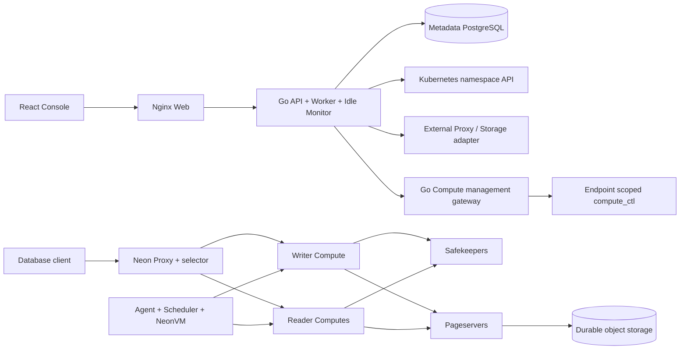
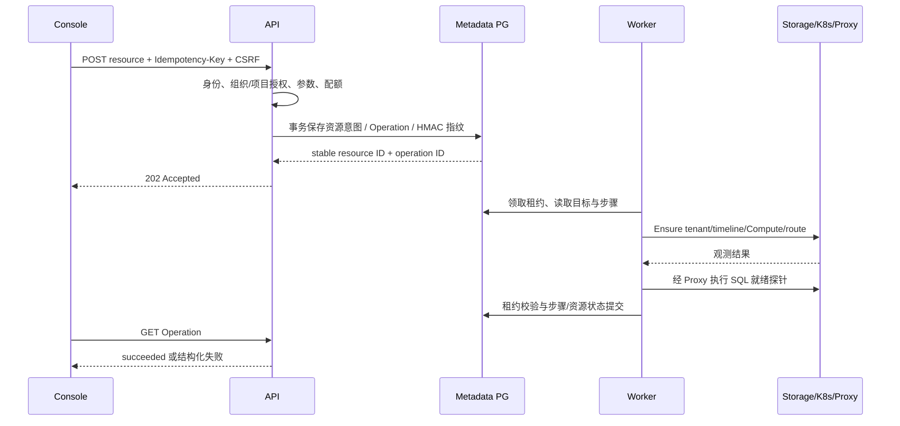
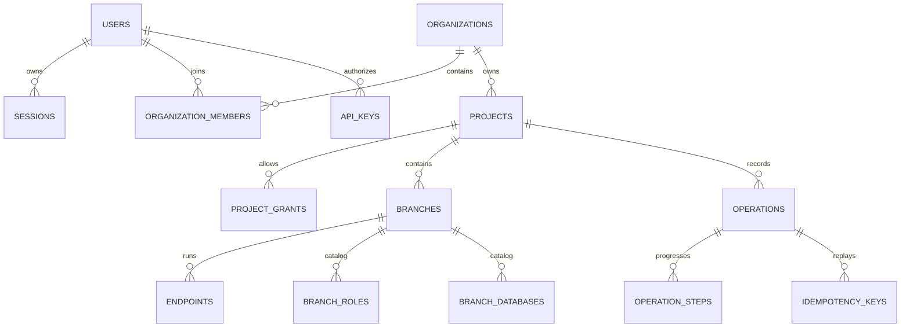
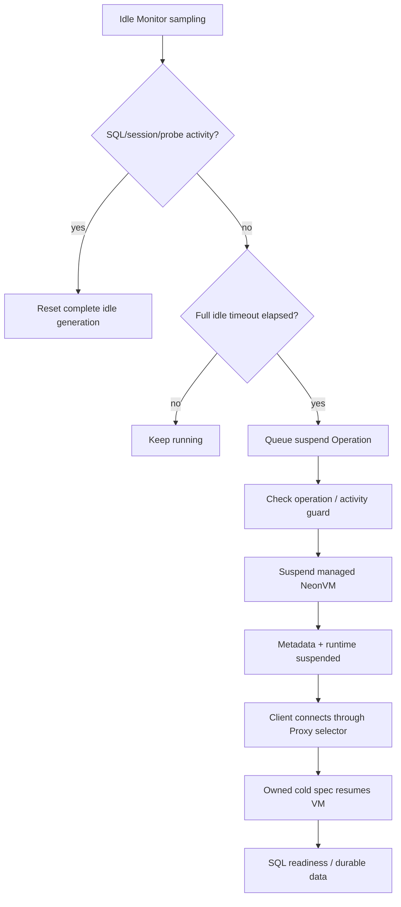

# 架构与数据模型

## 1. 整体边界

目标语义参考固定官网快照的 `the-object-model`、`branch-your-backend` 与 Compute 文档。
Organization 是权限和配额边界；Project 是区域与资源边界；
Branch 是数据库 Timeline 和未来 Backend 服务版本边界。当前只有 Postgres 可用。

API、Worker、Idle Monitor 当前是一个进程、一个副本；这属于明确限制。
管理网关只承载原生 Compute 管理协议，不是 SQL/HTTP Data API。
Metadata PostgreSQL 必须与用户项目生命周期独立。

## 2. 请求与幂等调谐

同一主体、同一作用域、同一 key 的同内容请求重放返回相同资源；
内容冲突拒绝，不重复创建。外部操作使用稳定身份与所有权校验。
数据库租约只能保护数据库提交；尚不能证明所有外部动作具备跨实例 fencing。

## 3. 模型与不变量

物理模型以 `api/internal/control/migrations/001..008` 为权威。
新增结构只能通过新的前向迁移；没有通用安全的 down migration。

| 对象 | 关键字段/责任 | 约束 |
| --- | --- | --- |
| organizations / organization_members | org_id、user_id、role、配额 | membership 与项目 additive grants 联合计算权限 |
| projects | org_id、tenant_id、region_id、postgres_version、default_branch_id、version | live name 组织内唯一；本版固定 PG16/单 Region |
| branches | project_id、timeline_id、parent_branch_id、parent_lsn、is_default、version | Timeline 身份稳定；父子数据变更隔离 |
| endpoints | project_id、branch_id、selector、endpoint_type、workload/service、bounds、idle timeout、version | 每分支最多一个 writer；多个 reader；Selector 唯一 |
| branch_roles / branch_databases | 分支、目录名、状态、owner/credential_ref、version | 意图与 PG live catalog 分离；密码只在 owned Secret |
| operations | resource/action/state、payload、actor/request、attempts、lease_owner/expires | endpoint 或 branch_catalog 活动操作被唯一索引序列化 |
| operation_steps | ordinal、name、state、attempts、detail | 只允许当前有效租约更新；失败保留证据 |
| sessions / api_keys | 主体、token/key hash、expiry、scope/ceiling | 撤销和过期服务端检查；token 不持久明文 |
| audit_events / metrics | 主体/资源/动作、观测时间与指标 | 当前保留范围有限，不能替代完整生产审计与长期 TSDB |
| branch_service_instances | 服务类型/能力、实例状态 | Postgres 外的服务 disabled；Data API 属于 PG 服务目标 |

Endpoint 资源支持整数 CPU 1000–2000m 和内存 1024–3072Mi、1024Mi slot。
这些边界是本发行兼容范围，不能自动解释为资源热缩回全部通过。

## 4. 休眠与唤醒流程

监控页面不能为了采集唤醒休眠 Endpoint。新代次必须完整计时。
跨 Proxy 实例单飞、采样间短连接活动账本、删除与新连接竞争仍是生产门槛。

## 5. 扩展规则

新的 Backend Driver 必须定义 desired/observed generation、秘密引用、幂等键、
有界超时、错误分类、恢复/补偿、权限作用域及覆盖明确的 API/UI。
后续分离 Worker、接入 outbox 与外部 fencing，再开启多实例；
服务 API 与模型扩展必须保持旧合同可演进，不能仅用 disabled→enabled 宣告实现。
