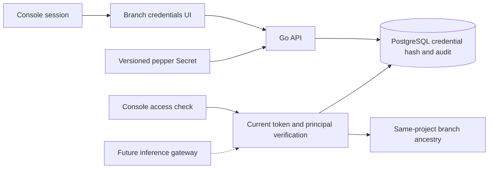

# Branch application credentials v1

## 1. Product boundary

Console **应用凭据** manages application credentials separately from Console
sessions, control API keys, database passwords and supplier keys. This follows
the branch and descendant scope in [Neon's authentication documentation](https://neon.com/docs/ai-gateway/authentication).
It implements credential management and a real authorization check. **It does
not implement AI inference, onboard providers or enable the AI Gateway service.**

Only `ai_gateway:invoke` is supported in this increment. A credential cannot
authenticate Console APIs. The authorization checker requires an existing
Console session and Editor access; it is not a public model endpoint.



## 2. Data and authorization

Migration **011** adds `backend_credentials` and `backend_credential_requests`.
Each credential references organization, project, branch and the issuing user.
A composite branch/project foreign key prevents mismatched anchors. Public
metadata contains ID, name, scope, model restrictions, generation, expiry,
revocation and rotation timestamps. Secret material never enters an Operation.

The token format is `ncb_<24-hex-id>.<64-hex-secret>`. The secret is generated
from 32 CSPRNG bytes. PostgreSQL stores only a domain-separated HMAC-SHA256 hash
and the pepper version; the pepper is held separately in an API-only Secret.
It must be backed up independently with the metadata recovery material.

`self` permits the anchor branch. `self_and_descendants` also permits descendants
in the same project; a child's token cannot access its parent or sibling.
Traversal checks ready, undeleted branches and rejects cycles/depth over 128.
Model restrictions narrow access and never grant access to an unavailable model.
An empty model list still requires the future gateway's model entitlement check.

Every verification uses current PostgreSQL state in one query snapshot: token
generation/hash, expiry/revocation, issuer enabled status, active organization,
current organization membership and additive project permission, project and
anchor status, target ancestry and requested scope/model. There is no positive
per-process credential cache. A later authorization change is observed by the
next check; revocation does not retrospectively cancel an already admitted
request. Inference admission and in-flight cancellation remain future work.

The issuer must currently have Editor or Admin permission. Console credential
metadata `active` means unexpired and unrevoked; it is not proof of current
issuer or model access. Use **检查应用凭据** to check effective authorization.
`last_used_at` is reserved and not updated by this non-inference checker.

## 3. API contract

All paths begin `/api/v1/projects/{project}/branches/{branch}/credentials`.
The bundled [OpenAPI](../contracts/openapi-v1.json) defines actual routes only.

| Method/path suffix | Authorization | Result |
|---|---|---|
| GET | Viewer; session or scoped control API key | Metadata only; 100-item cursor page |
| POST | Console session, Editor/Admin, CSRF | Create; 201 with one-time `api_token` |
| POST `/{credential}/rotate` | Issuer or project Admin; current Editor access | New secret, same ID, incremented generation |
| DELETE `/{credential}` | Issuer or project Admin; current Editor access | Revoked record retained |
| POST `/check` | Console session, Editor/Admin, CSRF | Current branch/model authorization; no inference |

Create/rotate body:

```json
{
  "name": "server-app",
  "scopes": ["ai_gateway:invoke"],
  "branch_scope": "self_and_descendants",
  "allowed_models": [],
  "expires_at": "<RFC3339 UTC timestamp, more than 1 minute and at most 30 days ahead>"
}
```

`Idempotency-Key` is required for mutations, 8–128 bytes. Rotate/revoke also
require quoted `If-Match: "<generation>"`; missing version is 428 and stale
version is 412. Same actor/key with different normalized input is 409. Quota
is 100 active credentials per branch, enforced while holding the branch lock.

```mermaid
sequenceDiagram
  participant U as Console
  participant A as Go API
  participant D as PostgreSQL
  U->>A: Create with Idempotency-Key and CSRF
  A->>D: Lock actor/key, then branch; authorize and check quota
  A->>D: Hash-only credential, public replay response, audit in one transaction
  A-->>U: 201 metadata + api_token (once)
  U->>A: Identical replay
  A->>D: Load public replay record
  A-->>U: 200, Idempotency-Replayed=true, no api_token
  U->>A: Rotate with current If-Match
  A->>D: Replace hash/version, increment generation, retain audit
  A-->>U: 200 + new one-time token
```

One-time delivery is intentional. Idempotency replay never restores plaintext,
including after a lost network response. Rotate to obtain a replacement token.
The stable idempotency HMAC key is separate from the versioned credential pepper,
so activating a new pepper does not invalidate replay identity.

Checker body: `{"api_token":"<memory-only-token>","model":"<optional-model-id>"}`.
Invalid/expired/revoked credentials return 401, valid tokens outside branch/model
scope return 403, and unavailable metadata/key versions return 503. Success
returns `inference_available:false`. It is not a substitute for supplier or
gateway availability verification.

## 4. Deployment and key rotation

Use a Kubernetes Secret named by `backendCredentials.existingSecret`, containing
`keyring.json`, with an independently generated base64-encoded 32–64 byte pepper:

```json
{"active":"v1","keys":{"v1":"<base64-random-secret>"}}
```

Create the material on the operator's protected Linux host using a cryptographic
random source and restrictive file permissions. Do not type secret values into
shell arguments, CI variables printed in logs, Git, Helm values or chat.
Create an immutable Secret from that protected file. Back up the file encrypted
and test recovery separately; a hash in a delivery report is not a backup.

```bash
kubectl -n neon create secret generic backend-keys-v1 \
  --from-file=keyring.json=/secure/backend-keys/keyring.json
kubectl -n neon patch secret backend-keys-v1 --type=merge \
  -p '{"immutable":true}'
```

Enable via protected Helm values:

```yaml
backendCredentials:
  enabled: true
  existingSecret: backend-keys-v1
  labHTTP: false
api:
  cookieSecure: true
```

Use a real HTTPS Console endpoint; secure cookies alone do not provision a
certificate. Helm rejects insecure cookies unless `labHTTP:true` explicitly
selects the isolated laboratory exception. The keyring mounts only in the API,
not Worker, Web or Compute. Startup rejects malformed/missing key material and
requires the existing stable idempotency key.

To rotate the pepper, create a new immutable Secret with `active:v2` and retain
both v1/v2 values. Roll out the API using the new Secret. New credentials use
v2; old unexpired v1 credentials still verify. Rotate/revoke all v1 credentials,
confirm none remain usable, and only then remove v1 in a later Secret/rollout.
Retain recovery copies according to the backup policy. Never silently replace
pepper values: losing a referenced version makes those credentials unverifiable.
This singleton rollout does not certify multi-replica HA.

## 5. Verification and manual product flow

1. Open a ready project's **应用凭据** page; select a branch.
2. Create a name, expiry, scope and optional model restrictions. Save the
   one-time token in the application's server-side secret store.
3. Close/reload; verify plaintext cannot be retrieved again.
4. Check on the anchor and child branch; test child-to-parent/sibling denial and
   `self` denial on a child. A data-only branch requires no running Compute.
5. Test an allowed and disallowed model ID. These are authorization checks,
   not actual model calls.
6. Rotate; the old token must return 401 and the new token must pass.
7. Revoke; retain the public record, and verify subsequent checks return 401.

Linux real-PG tests cover expiry, current issuer downgrade, tenant negatives,
forged project/branch paths, API-token separation, stale version, concurrent
idempotency, peer-server revocation, pepper activation and no plaintext in
durable replay. The opt-in browser suite starts from Console login and performs
the product flow against deployed Go/PostgreSQL; it retains data-only branches
and revokes only the credentials minted by that test:

```bash
export NEON_E2E_CREDENTIAL_PROJECT='<owned retained ci-* project>'
# Other Linux BASE_URL/admin-file/private-dir/evidence variables: TESTING.md.
cd web
npm run test:e2e -- backend-credentials.spec.ts
```

## 6. Next product stages

Provider administration UI, encrypted supplier key storage/rotation, probed
model catalog, model entitlements, actual inference protocols, Playground,
admission quotas, durable usage/charging, in-flight cancellation and provider
fault matrix are not included here. See [AI Gateway platform design](AI-GATEWAY-PLATFORM-DESIGN.md).
Auth, Functions and Object Storage require their own implementations and
acceptance; credentials do not enable those services by implication.
