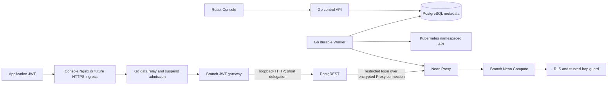

# Native Data API Driver v1

## 1. Delivery boundary

The Go control API, durable Worker, PostgreSQL metadata model, React Console,
branch authentication gateway and pinned PostgREST runtime implement a native
Data API lifecycle. This increment does not implement Managed Auth, dynamic
provider discovery, RPC, views, partitioned tables, HA or production TLS.

The Driver is disabled by default. The first transport profile requires
`dataAPI.enabled=true` **and** `dataAPI.labHTTP=true`. Setting those values is
an explicit development exception, not a production qualification. Each branch
uses one two-container Deployment; idle Compute can suspend independently.

## 2. Architecture



```mermaid
sequenceDiagram
  participant U as Console user
  participant A as Control API
  participant M as Metadata
  participant W as Worker
  participant K as Kubernetes
  participant D as Neon PostgreSQL via Proxy
  U->>A: POST data-api, If-Match, Idempotency-Key
  A->>M: lock branch; validate generation, audience and pending Operations
  A->>M: commit service intent, durable Operation, steps, idempotency record
  A-->>U: 202 stable Operation
  W->>M: claim and renew Operation lease
  W->>K: reserve immutable generation-specific Secret
  W->>D: transaction: owned restricted roles, RLS checks, grants, request guard
  W->>K: CAS publish only writer's service verifier
  W->>K: reconcile owned Service and Deployment
  W->>D: verify actual login, SET ROLE and privileges
  W->>M: locked lease + generation check; commit active observation
  U->>A: GET status (runtime observation, no SQL wake)
```

## 3. Models and APIs

Migration **010** adds `data_api_instances`. It references the project, branch
and Writer; stores a generation, typed public spec, state and Secret reference.
Passwords, delegation seeds, tokens and verifiers never enter metadata.

| Field | Contract |
|---|---|
| `generation` | Increases for every admitted enable/disable Operation |
| `state` | `provisioning`, `active`, `disabling`, `disabled`, `degraded` |
| `spec.database/schema` | One database and one dedicated application schema |
| `spec.issuer/audience` | Exact provider identity; tuple remains unique after disable |
| `spec.jwks` | Static public RS256/EdDSA keys; private key parameters rejected |
| `spec.allowed_origins` | Exact HTTPS origins; no wildcard or credentialed CORS |
| `secret_ref` | Immutable Secret named for branch and credential generation |

`GET /api/v1/projects/{project}/branches/{branch}/data-api` is authorized for a
project Viewer. It returns configuration, generation ETag, relative entry URL,
request role and observed runtime; it never connects to SQL.

`POST` and `DELETE` on that path require Editor/Admin, CSRF for Console sessions,
`Idempotency-Key` (8–128 characters), and `If-Match: "<generation>"`. Initial
generation is zero. Return `202` with a durable Operation and branch ID.
Repeated identical requests return the original Operation; changing input with
the same key returns `409`. Stale generation returns `412`; missing version
returns `428`. A branch with another active Operation returns `409`.

POST body:

```json
{
  "database": "postgres",
  "schema": "app_data",
  "issuer": "https://identity.example.test",
  "audience": "a-unique-branch-audience",
  "jwks": {"keys": []},
  "allowed_origins": []
}
```

Replace the empty key array with the identity provider's **public** JWKS. Empty
JWKS is invalid. Do not reuse audience across branches. Provider Tokens require
`iss`, exactly one `aud`, nonempty `sub`, valid `exp`; omit `role` to use the
managed request role. Console API keys are not application JWTs.

Application entry: `/data/v1/{branch}/{table}` supports GET/HEAD/POST/PATCH/DELETE
and OPTIONS, PostgREST filters and bounded request bodies. It ignores Console
cookies. RPC and unsafe relations are outside this increment's acceptance.

Console Explorer uses POST `.../data-api/request`, a session/CSRF-protected
Editor action. Its body contains method, table, application_token and optional
JSON body; the server forwards only the application JWT to the actual relay,
without Console cookies or browser Origin. It accepts a table name, never a URL
or arbitrary target. The control action returns `{status,body,truncated}` with
the actual upstream status and a 64KiB result bound. This allows the laboratory
Console to test writes without weakening the public gateway's strict HTTPS CORS
allowlist. Neither request JWT nor response body is persisted or logged.

## 4. Database preparation through the UI

In SQL Workbench, connect as the application's schema owner. Run each statement
separately. This example scopes rows by the verified provider subject:

```sql
GRANT CREATE, CONNECT ON DATABASE postgres TO control_probe WITH GRANT OPTION;
CREATE SCHEMA app_data;
CREATE TABLE app_data.notes (
  id text PRIMARY KEY,
  owner_id text NOT NULL,
  body text NOT NULL
);
ALTER TABLE app_data.notes ENABLE ROW LEVEL SECURITY;
ALTER TABLE app_data.notes FORCE ROW LEVEL SECURITY;
CREATE POLICY owner_rows ON app_data.notes
  USING (owner_id = current_setting('request.jwt.claims', true)::jsonb->>'sub')
  WITH CHECK (owner_id = current_setting('request.jwt.claims', true)::jsonb->>'sub');
GRANT USAGE ON SCHEMA app_data TO control_probe WITH GRANT OPTION;
GRANT SELECT, INSERT, UPDATE, DELETE ON app_data.notes
  TO control_probe WITH GRANT OPTION;
```

The database owner delegates CREATE for the private guard schema and CONNECT
with GRANT OPTION for the service login. CREATEDB alone does not provide those
privileges on an existing database; the native Neon acceptance found this
distinction. Missing grants produce an actionable prerequisite error.
The application's schema owner explicitly delegates the ability to grant these
privileges. For sequence-backed columns, also grant sequence USAGE/SELECT with
GRANT OPTION. Do not grant PUBLIC access. A nonowner restricted role receives
the final application grants; the managed login has NOINHERIT and can SET only
that role. Both identities are NOSUPERUSER, NOBYPASSRLS, NOCREATEDB,
NOCREATEROLE, NOREPLICATION. Ordinary Compute-role provisioning is deliberately
not used because it grants administrative/BYPASSRLS permissions.

Every exposed table must ENABLE and FORCE RLS; at least one base table is
required. Views, foreign/partitioned tables and exposed functions fail closed.
The transaction verifies role attributes, membership and ownership comments.
The pre-request guard checks delegated issuer, branch, audience, subject and
RLS/role drift. New tables need owner-supplied RLS and grants; the Driver does not
guess their policies or automatically add privileges.

## 5. Deployment and recovery

Set digest-pinned `dataAPI.gatewayImage` and `dataAPI.postgrestImage` in Helm
values. `Dockerfile.postgrest` packages the official 16.4 static binary only after
verifying the archive SHA from `containers/services.lock.json`. Linux CI builds
and publishes both components with provenance and SBOMs. The API/Worker Role
gains namespace Deployment create/update only when the Driver is enabled.

Each branch runtime reserves 100m CPU and 96Mi total requested memory, bounded
at 1 CPU and 384Mi across its two containers. It runs nonroot with read-only
roots, no Kubernetes token and projected Secret files. The gateway sees only
provider configuration and its signing seed. PostgREST sees only its DB config
and delegation public key; it cannot read the signing seed. PostgREST listens
on Pod loopback, never the ClusterIP. The public Service exposes the gateway.

PostgREST limits its pool to one connection and requests a one-second idle
pool lifetime. **That setting alone did not close physical connections in the
real Neon acceptance attempt.** The static profile sets
`db-channel-enabled=false` to remove the persistent LISTEN connection. It also
sets PostgreSQL `idle_session_timeout=5s` on the **owned service login only**;
ordinary users and database defaults are unchanged. Active queries and open
transactions retain their sessions. This follows the [PostgREST configuration
reference](https://docs.postgrest.org/en/stable/references/configuration.html)
and [PostgreSQL 16 timeout semantics](https://www.postgresql.org/docs/16/runtime-config-client.html#GUC-IDLE-SESSION-TIMEOUT).
PostgreSQL cautions that poolers may mishandle closed sessions, so the pinned
runtime must pass physical-session observation plus the first HTTP write after
each idle window, without retrying writes. A configuration file alone is not
acceptance evidence.

Without LISTEN, NOTIFY-based schema reload is unavailable in this profile.
After DDL changes, supply RLS/grants and explicitly disable/re-enable Data API
to refresh its schema cache. Existing immutable generation Secrets are not
modified by an image upgrade; re-enable to receive this configuration. Manual
suspend waits up to ten seconds for ordinary connection closure, rechecks all
four SQL activity guards and retains UID-preconditioned VM deletion. Continued
client sessions, replication, subscriptions or autovacuum produce
`compute_in_use`; no service login is excluded or forcibly terminated.
Readiness probes observe gateway configuration without SQL, so UI polling does
not continuously wake Compute. The last successful provisioning observation is
distinct from continuous end-to-end availability.

Worker replay reuses the immutable Secret, verifies ownership before touching
SQL or Kubernetes resources, updates the route registry by resourceVersion CAS,
and verifies its lease/generation before committing metadata. Unexpected failure
marks `degraded`; it never silently becomes active. Inspect Operation steps,
repair the cause and retry the same Operation. Generation supersession blocks
stale retries. External distributed fencing remains a separate production gate.

Disable withdraws the Writer's service verifier, scales only the owned Deployment
to zero, waits for observation and commits disabled. It preserves application
rows, SQL roles, Secrets and evidence. Re-enable reserves a new signing key and
password generation. Disable does not revoke an identity provider's tokens;
they are accepted again after re-enable if the configured trust remains valid.

## 6. Linux verification

Use `tools/ci-go.sh` with a disposable **control_ci** database and the verified
PostgREST executable; never use the production metadata DSN. The native SQL
integration tests check unprotected-table refusal, SQL replay, real RLS access,
forged writes, missing issuer, post-provisioning RLS drift and unowned roles.
The actual pinned PostgREST/PG test also checks three physical idle closures,
first-write reconnection, a query longer than the idle timeout and a transaction
held idle beyond that timeout. These are prerequisites for the live Neon test,
not a claim of cross-instance external admission fencing.

Run `npm run test:e2e -- data-api.spec.ts` in the Linux browser image with the
documented private credential/evidence mounts. It starts from Console login and
project creation, prepares SQL through Workbench, enables via UI, tests
idempotency, two-subject reads, invalid JWTs, forged/valid inserts, disable and
re-enable, Compute suspend and real Data API cold wake. It separately observes automatic idle suspension with Data API
still enabled and then a successful first Data API request after that idle.
Polling during the idle window reads Kubernetes runtime, not application SQL.
It stops the tested
runtime and Compute after success; database and records remain available.

Keep each attempt's JSON, logs, screenshot and source/image hashes. Passing
ordinary PostgreSQL tests is not a substitute for passing this real Neon UI test.
The deployment-specific evidence report determines acceptance, not this manual.

## 7. Official product alignment

Neon's [Data API description](https://neon.com/blog/a-postgrest-compatible-data-api-now-on-neon)
defines per-branch REST, application JWT/RLS, and a REST service that remains
available while database Compute sleeps. Its hosted implementation is Rust
inside the Proxy fleet. Our first Driver implements those accepted semantics
using a separate, pinned PostgREST service; it does **not** claim identical
implementation, all protocol features, footprint or hosted latency. Moving to
a shared Rust runtime requires its own parity, isolation, capacity and recovery
tests. Our current schema-cache reload, transport and supported-relation limits
must remain visible to operators and application developers.
