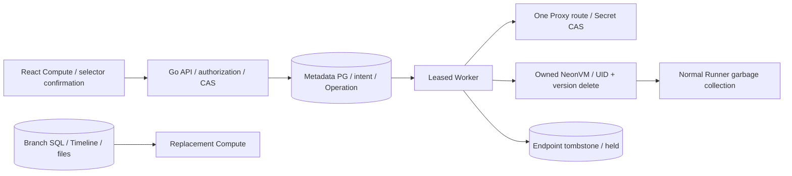

# 独立 Compute 删除与重建

## 1. 产品目标与范围

依据官方 website 快照 `c0d49cbb6979b2ce79ea502d62dbc40780a923b0` 的
[`manage/computes.md`：Delete a compute](https://neon.com/docs/manage/computes#delete-a-compute)：
分支可以有一个 Writer 和多个 Reader，任何 Compute 可以单独删除；分支数据保留，
重新添加 Compute 后使用新的连接信息。

本增量提供 Go API/独立 Worker、前向迁移 018、OpenAPI 0.10.1 和 React Compute
页面。源代码实现、开发测试、现场 UI 验收和生产准入分别记录。
缩零保留同一地址并允许冷醒；删除永久关闭旧 Selector，重建分配新 ID/Selector。
分支 Timeline、数据库、角色、文件、WAL、Secrets 和证据保留，不执行物理 GC。

分支保护仍允许删除 Compute，因为不删除分支数据。Data API、Auth、Object Storage
仍依赖原 Writer 时，必须先明确停用。其他 Compute 不随此操作关闭。项目恢复只
恢复该次项目删除时仍存活的 Endpoints，之前单独删除的 Endpoints 保持关闭。

## 2. 架构、时序与状态



```mermaid
sequenceDiagram
  actor U as Editor / Admin
  participant A as Go API
  participant M as Metadata PG
  participant W as Worker
  participant K as Kubernetes / Proxy
  U->>A: DELETE + exact selector + If-Match + Idempotency-Key
  A->>M: Lock project, branch, endpoint; check dependencies
  A->>M: Commit one Operation and endpoint=deleting
  A-->>U: 202 with stable Operation
  W->>M: Claim lease and validate immutable scope
  W->>K: CAS only this Proxy route to deleted
  W->>K: Delete owned VM with UID/resourceVersion
  W->>K: Observe VM absence and normal Runner disappearance
  W->>M: Commit endpoint tombstone under valid lease
  U->>A: GET original Operation; only read retries
  Note over U,A: Lost 202 reply: resend same key, version and selector
  U->>A: Create new Writer with original branch password
  A->>K: Reuse branch role/probe verifiers; new signing identity
  W->>K: Start new VM and publish new Selector
```

Metadata 状态 `active → deleting → deleted`。`active` Endpoint 的 VM 可处于休眠。
API 受理事务关闭新控制请求；Worker 第一阶段关闭 SQL Proxy 路由。删除允许中断
原地址上的现有 SQL 连接，调用方须先停止应用访问。不能将此流程描述成已经通过
跨实例外部连接栅栏、HA 或磁盘延迟 SLO。

## 3. API 与模型合同

`DELETE /api/v1/projects/{project}/endpoints/{endpoint}`：

```http
If-Match: "<current endpoint version>"
Idempotency-Key: <stable request key, 8-128 characters>
X-CSRF-Token: <session csrf token>
Content-Type: application/json

{"confirm_selector":"<exact endpoint selector>"}
```

返回 `202 {resource, operation}`，`Location` 指向 Operation。未知请求字段被拒绝。
Editor/Admin 可操作，Viewer 403；跨租户 404。父资源/Endpoint 未就绪、启用的依赖
服务、活跃项目 Operation、幂等冲突返回 409；版本过期 412、缺少引号版本 428；
确认/input 错误 422；metadata、凭据或 Driver 不可用 503。

原 key/version/body 在删除完成后仍返回原 Operation。故障恢复调用原
`POST .../operations/{operation}/retry`，不创建另一条删除意图。UI 观察超时不等于
后台失败，窗口提供继续观察；未知写入结果不盲目重发外部写操作。

| 模型 | 不变量 |
| --- | --- |
| endpoint intent | project/branch/endpoint ID 为不可变 scope；deletion_operation_id 绑定意图；scale_to_zero=false |
| Operation | resource_type=endpoint，沿用活跃唯一索引；payload 只有身份，无密码/VM 模板 |
| steps | close_endpoint_proxy_admission、retire_owned_endpoint_compute、observe_endpoint_runners_gone、persist_endpoint_tombstone |
| tombstone | resource_type=endpoint、snapshot 只有 ID、physical_gc_state=held；无独立 Endpoint 恢复 API |
| Proxy route | 原 Secret 与 VM 模板保留；state=deleted 拒绝冷醒；绑定删除 Operation |
| replacement | 新 ID/Selector/签名身份；复用保留的 cloud_admin/control_probe verifier |

迁移 018 拒绝删除后由旧 API 读或 idle 采样入队的工作，保留原失败创建/删除重试。
空 endpoint_id 代表纯数据分支，不能被当作真实 Endpoint；历史点恢复仍须通过回归。
不会修改已应用迁移。新 Endpoint 创建先锁项目再锁分支。Worker metadata 提交检查
有效 lease，外部 Kubernetes epoch fencing 仍是独立门槛。

Writer 重建须使用原分支 SQL 密码，不隐式轮换角色。密码校验先于新 Secret 创建，
不写入 metadata/Operation/报告。复用原 role/probe verifier 保持现有 Reader 及监控
认证有效；新 Endpoint 的管理签名身份独立。密码不匹配返回 422
`branch_password_mismatch`；角色管理合同负责应用角色的显式轮换。

## 4. 手动与自动端到端复测

1. Admin 登录 Console，创建唯一 `ci-...` 项目；每个 Compute 1 vCPU/1 GiB。
   安全保存 SQL 密码，在 SQL 页面建探针表并插入记录。
2. 添加两个 Reader，分别确认相同记录。选择第一个 Reader，点击“删除此 Compute”，
   输入准确 Selector；等待四阶段 Operation 成功，原 Reader 消失。
3. 原连接信息/查询入口关闭；Writer/第二个 Reader 及数据不变。原请求的同 key、
   version、body 重放应返回同一 Operation。
4. 开启 Object Storage，Writer 删除应被 `endpoint_has_services` 409 阻止。停用
   服务后删除 Writer；第二个 Reader 仍能查询。
5. 同分支添加新 Writer，输入原密码。Selector 不同、原数据/角色保留；新写入
   从真实 WAL 到达原 Reader。不同密码应被拒绝。
6. 重新启用已停用 Object Storage，检查绑定新 Writer；再停用服务。
7. 删除全部 Compute，页面显示数据保留的空状态。再次添加 Writer，应读取全部
   原始记录。branch Timeline 身份不变。
8. 解除自有测试项目/分支保护，删除并恢复项目；只恢复最近存活的 Writer，之前
   单独删除的 Endpoints 不复活，SQL 数据完整。
9. 完成后再次保留删除自有测试项目，释放运行和逻辑配额；查看 Endpoint tombstones，
   保留所有数据、凭据、Operation 和失败/成功证据。

`web/e2e/endpoint-deletion.spec.ts` 使用真实 Linux Chromium 登录/点击，额外在服务端
受理后丢弃一次 202，验证同 key/version/Operation 重放。`workers=1, retries=0`。
独立 PostgreSQL 开发测试覆盖迁移、权限、幂等和未知写入恢复；HTTP peers 不替代
真实 NeonVM UI 验收。现场功能测试不得并发。

SQL 工作台每次执行单条预处理语句，建表、插入和授权需分别提交。提交后的密码在
成功和失败时均清空；新套件验证多语句拒绝的负例及密码框清空。失败截图/ARIA
上下文仍须作为受保护证据，不能将包含凭据的原始记录上传公共仓库。

## 5. 后续门槛

物理 GC、保留 Secrets/模板长期策略、自动服务迁移、失败创建清理、TTL、跨实例
Proxy 连接账本与外部 fencing、HA/DR、小数 CPU、完整内存归还、全链路可信 TLS
仍需实现或验收。硬件停顿导致回收超时保留原失败，恢复条件后重试原 Operation，
不得强制删除 Pod 或把超时静默标为通过。
