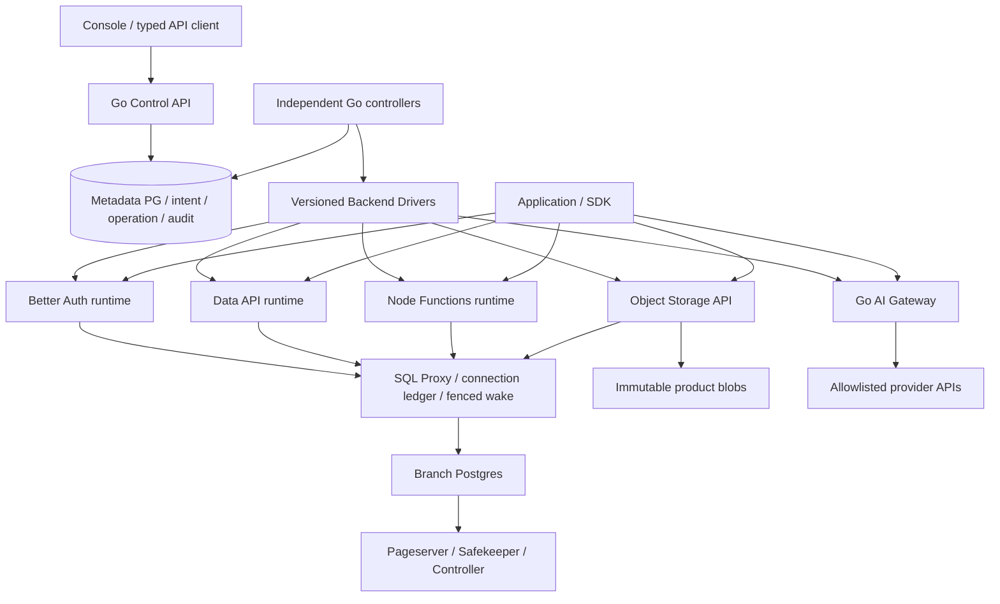
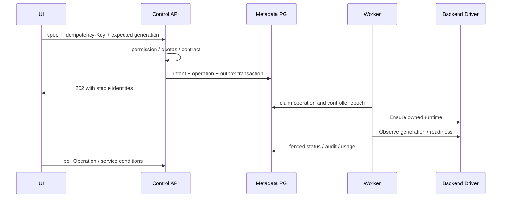

> 当前代码增量说明（2026-10-08）：[Managed Auth v1](MANAGED-AUTH.md) 已有 Go/TS/React/Helm 实现与 Linux 开发验证。本文后面的未来 API 与完整 Backend 设计仍是规划；实际注册的接口以 OpenAPI 0.9.0 为准，真实 Neon UI 以交付报告为准。Better Auth 1.4.18 是原网站快照的起点，本次锁定并测试的实际运行库为 1.7.7。

# 完整产品实施合同与验收顺序

## 1. 目标与当前状态

目标是依据 Neon 官网对象模型实现自托管 Backend，同时保持开源数据面可用。
本文件定义后续实现合同；它不改变 `/api/v1/capabilities` 的实际能力开关。
Managed Auth 基础服务已有实现，见 MANAGED-AUTH.md；Functions、产品 Object Storage 与 AI Gateway 推理尚未实现服务。
Data API 已加入原生 Go Driver、持久 Operation、最小权限数据库身份、PostgREST 调谐及 UI；
默认禁用，具体合同和真实 Neon 验收边界见 DATA-API-NATIVE-DRIVER.md。
分支应用凭据管理及当前权限检查已有实现，见 BACKEND-CREDENTIALS.md；AI 推理仍未启用。
PITR 已实现历史恢复到新分支的代码切片，见 HISTORICAL-BRANCH-RESTORE.md；
保护、依赖图、保留删除和七天项目恢复已有 Go/React 实现，见 RETAINED-DELETION.md。
原地恢复、完整 Backend 一致性恢复、物理 GC 与完整删除、细粒度资源回收、HA/DR 和跨实例 fencing
仍需独立开发与测试。逐项实施顺序见 PRODUCT-COMPLETION-PLAN.md。
API/Worker 拆分已有源码和 Chart，验收方法见 WORKER-SPLIT.md。
控制台受邀注册、组织邀请/撤销和已有账号接受已有 Go/React/API/迁移与测试代码；
详见 CONSOLE-INVITATIONS.md。这是 Console 身份功能；Managed Auth 使用独立的分支账户、会话、签名与协议，不能复用 Console cookie。

依据 `neondatabase/website` 快照 `c0d49cbb6979b2ce79ea502d62dbc40780a923b0`：

| 目标服务 | 官网语义 | 实现选择与约束 |
| --- | --- | --- |
| Managed Better Auth | 身份、会话、OAuth/JWKS 等在 neon_auth；分支 URL 与 token 隔离 | 固定 Better Auth 1.4.18 兼容起点；独立 TS 服务，Go 控制与配置；不手写 OAuth/password 协议 |
| Data API | PostgREST compatible、JWT、RLS、HTTP 无长期 TCP | 独立 PostgREST 数据服务；非 owner/non-BYPASSRLS 连接、issuer/audience/JWKS 与 schema allowlist |
| Functions | Node.js 24 JS/TS、长期服务、SSE/WS、cron/object trigger、随分支部署 | Go 调谐不可变 bundle；Node runtime，容器隔离、egress/limits、调度/事件幂等与日志 |
| Object Storage | S3 compatible、private/public_read、预签名、文件视图随分支 | 产品桶与 Pageserver 桶分开；不可变 blobs + 随 PG Timeline 克隆的对象清单；S3 协议 Driver |
| AI Gateway | 每分支 endpoint；统一平台凭据、多协议/模型、streaming、用量/预算 | 独立 Go gateway；平台管理员 UI 配置上游/密钥，项目用户使用模型目录和 scoped 凭据；真实上游由运营方接入 |

参考官网：[Auth](https://neon.com/docs/auth/overview)、
[Auth branching](https://neon.com/docs/auth/branching-authentication)、
[Data API](https://neon.com/docs/data-api/overview)、
[Functions](https://neon.com/docs/compute/functions/overview)、
[Storage](https://neon.com/docs/storage/overview)、
[AI Gateway](https://neon.com/docs/ai-gateway/overview)。
这些 URL 会演进；版本判断以已保存快照和后续实际核验日期为准。
AI Gateway 已于 2026-10-04 重新核验在线文档、目录和网站源码，
专用合同见 [平台配置、模型、凭据和验收设计](AI-GATEWAY-PLATFORM-DESIGN.md)。
官网用户无须提供供应商 API Key；自托管平台的运营方须接入真实上游，
配置 UI 是正式产品需求，不能长期要求项目用户手动提供 Kubernetes Secret 名称。

## 2. 总体架构

控制 API 承担权限、版本化意图、Operation、配额与审计；数据服务承担应用请求。
统一项目 Credential 不得自动变成控制面管理员，也不得把应用用户 Session 当 Console Session。
每个应用请求携带可信 branch scope，服务端根据数据库归属解析；不接收任意 target URL。

## 3. 数据模型

扩展 `branch_service_instances` 时保留旧主键和状态；新增字段通过前向迁移：

| 模型 | 核心字段 | 不变量 |
| --- | --- | --- |
| service intent | project_id、branch_id、kind、generation、spec_version、desired_spec、observed_generation、condition | observed 不得领先 desired；禁止把配置成功当 readiness |
| service secrets | secret_id、org/project/branch scope、type、key_version、external_ref、created/revoked | 不在 API/Operation payload/日志持久明文；轮换代次可审计 |
| application credentials | key_id、hash/secret_ref、project/branch scope、allowed_services/actions、expiry/revoke | key 只创建时返回；应用凭据不能调用控制 API |
| function releases | function_id、branch、bundle_digest、runtime_version、config_generation、active_release | immutable bundle；同一 release 可重放；环境变量秘密仅引用 |
| function triggers | trigger_id、event_kind、schedule/bucket/filter、retry/DLQ policy、generation | 执行去重 key=(trigger,event_id)，不可承诺 exactly-once 副作用 |
| service usage | event_id、scope、request_id、unit、quantity、reservation_id、status、sample_at | 预算先 reserve，结束 settle；上游已接收但结果不明时进入 uncertain，对账前不按 TTL 直接释放 |
| restore operations | source/target branch、timestamp/LSN、retention check、service snapshot refs、steps | 恢复到新分支优先；禁止不可恢复覆盖生产默认分支 |
| deletion intent | resource、generation、dependency snapshot、grace_until、tombstone、GC cursor | 前台隐藏/停入口与物理 GC 分离；恢复窗口之前保留数据 |

身份/对象清单与可克隆的服务配置需在用户数据库的受保护产品 schema 记录版本。
不可变对象与 Function artifact 以 digest 引用；用户无法改写内部 schema。
控制 metadata PG 保存运行意图与部署信息，不能单靠复制元数据实现时间点一致的 Backend 分支。

## 4. Driver 合同与调谐

Driver 必须支持 ValidateSpec、Ensure、Observe、Suspend/Resume、Clone、Delete、Restore
中自己声明的能力；未支持的操作返回明确 unsupported，不能空实现并返回 success。
每次调用传入稳定资源身份、generation、Operation ID、timeout 与 lease/fence token。
Ensure 返回实际 runtime identity 与 observed generation；Observe 不触发冷醒。
所有外部写入先验证 owner/project/branch 和 generation；请求重放不能创建第二套资源。

新增控制 API 合同（设计目标，当前路由尚未注册）：

| 方法/路径，前缀 `/api/v1/projects/{project}/branches/{branch}` | 合同 |
| --- | --- |
| PUT `/services/{kind}` | versioned spec + expected_generation；202 Operation；幂等键必需 |
| GET `/services/{kind}` | desired/observed generations、conditions、endpoint、redacted config |
| DELETE `/services/{kind}` | disable/deletion intent；202；保护与依赖冲突 409 |
| POST `/application-credentials` | service/action scope + TTL；一次返回 secret |
| DELETE `/application-credentials/{key}` | 即时 revoke；幂等；审计 |
| POST `/functions/{name}/releases` | bundle digest/runtime/env refs；202；不接收任意宿主机命令 |
| GET `/functions/{name}/logs` | 有界游标/时间范围；服务范围授权；脱敏 |
| PUT `/functions/{name}/triggers/{trigger}` | 类型化 cron/object spec，generation CAS |
| POST `/restores` | timestamp 或 LSN 二选一；目标新 branch；202；历史窗口失败 422 |

通用错误：401 身份、403 scope、404 隐藏跨租户资源、409 generation/dependency、
422 spec/retention、429 quota/budget、503 dependency。错误返回 request_id，秘密不回显。
正式实现时必须进入实际 OpenAPI、Go 路由双向校验与 typed UI；本设计表不是 Swagger 可用接口。
通用 `/application-credentials` 为早期合同占位；Backend scoped credentials 的正式路径及一次明文、
幂等重试、到期/撤销语义以 BACKEND-CREDENTIALS.md 和已实现 OpenAPI 的 `/credentials` 为准。
供应商、模型目录及推理合同仍以 AI-GATEWAY-PLATFORM-DESIGN.md 作为演进目标。

## 5. 各服务独立放行

### Auth

先实现 email/password、session、logout、JWT/JWKS 与 trusted origins；随后 OAuth、
验证邮件/密码重置、组织/RBAC/MFA 逐项启用。SMTP/OAuth/provider Secrets 为真实部署输入。
独立 branch issuer/audience/cookie signing 与 URL，复制 JWKS 不能允许跨分支 token。
必须验证用户继承、父子账号变更隔离、父 cookie/JWT 在子拒绝、轮换与撤销。
Console 管理页含用户/Session/OAuth 设置、操作记录、日志和用量。

### Data API

JWT issuer/audience/JWKS cache/rotation 要求 HTTPS trust 与有界刷新。
测试实际 `authenticated` role 的 PostgreSQL RLS、anon policy、RPC allowlist、
schema 暴露、JWT 过期/错签/跨 branch、租户 A 无法读取 B。不能使用 owner 或 probe role 绕过 RLS。
PostgREST compatibility 要实测过滤、排序、分页、返回/计数、写入与事务错误，不能只做 SELECT 包装。
UI 包含 endpoint、schema/role policy、RLS advisor 和真实请求示例。

### Object Storage

S3 SigV4、presigned URL TTL、桶 ACL、list/range/etag/条件写、multipart 生命周期、
统一 Credential 撤销、CORS、配额、审计均需合同测试。
上传先写不可变 blob，数据库事务发布清单；失败 blob 进入延迟 GC。
branch 克隆只克隆清单视图，后续同 key 写入/删除不影响父分支。
GC 必须感知所有 branch/PITR references；Pageserver 持久桶不作为公开产品桶。
UI 含桶/对象浏览、上传/下载/预签名、ACL、日志与容量。

### Functions

Node 24 immutable release；默认禁特权、宿主挂载和控制 SA，限制 PID/CPU/RAM/ephemeral storage。
DATABASE_URL 指向 branch 的受限角色，冷醒经统一入口；退出/更新不得丢 Operation。
实测 HTTP、SSE/WS、长期请求、idle eviction、env refs、部署/回滚、cron 与对象事件重试/DLQ。
发布目录、状态、实时日志、流量/资源与 triggers 在 UI 可操作。

### AI Gateway

模型 catalog 指向明确 provider/model；提供 OpenAI-compatible streaming，
再扩展 Responses、Anthropic/Gemini 协议；不能把 HTTP 原样转发宣称所有协议完成。
禁任意 URL/headers 转发；provider key 与用户 key 隔离，预算与并发 reserve/settle 持久化。
实测错误映射、SSE cancellation、超时、限额/透支竞争、跨 branch、撤销、真实 provider。
UI 包含模型、凭据、预算、用量与请求日志；测试 provider stub 单独标记，不能代替真实推理验收。

## 6. 数据面与生产设施门槛

PITR 需读 native timestamp→LSN、实际 GC cutoff/history window，在允许边界克隆新 Timeline，
验证数据、Auth/清单与服务 artifact；PG 恢复不意味着外部 blobs/provider 调用倒退。
项目/分支删除需依赖图、默认分支保护、入口关闭、角色/route/VM 回收、保留窗口、
幂等重试、tombstone/GC 和 UI 确认；不得删除本项目已有验收记录。
小数 CPU 要在 Guest 实际 cgroup quota、调度与 SQL 压力下验证；内存回收需压力/OOM/balloon/slot 回路。
跨实例 fence 需要 Proxy 接入的连接 ledger、generation gate、短连接活动和旧 worker 外部动作拒绝。
TLS 包括浏览器/API、SQL verify-full、gateway SNI、metadata PG、service/JWKS/provider；
私网没有公网域名时使用运维 PKI，客户端必须实际信任 CA，不能关闭验证冒充可信 TLS。
HA/DR 要求不同故障域、metadata HA、对象/WAL/Secrets/镜像恢复、实测 RPO/RTO；
同宿主机多个 VM 不能当作跨故障域证明。

## 7. 实施与交付顺序

1. API/Worker 分离、领导租约、独立 Helm、真实 UI 队列/恢复与心跳。
2. Go adapter、连接 ledger、外部 fencing、可信 TLS 与资源/IO 预算。
3. Better Auth + Data API：身份→JWT→RLS→branch 克隆与冷醒的完整小闭环。
4. 不可变 Object Storage + Functions：清单克隆→事件→函数→branch SQL。
5. AI Gateway：真实推理→预算→用量→Functions/Storage/Data API 综合应用。
6. PITR/删除/GC、CPU/RAM 完整边界、多实例 HA/全栈 DR 和长期负载。

每个增量需要提交源码、实际 OpenAPI/模型/迁移、Helm/digest、UI、负例与恢复测试、
失败与成功证据。Linux CI 使用独立 disposable PG；真实集群每次只跑一个资源受控切片。
只有达到对应 Gate 才开放 capability；完整官网目标未达成前保持预览状态。
