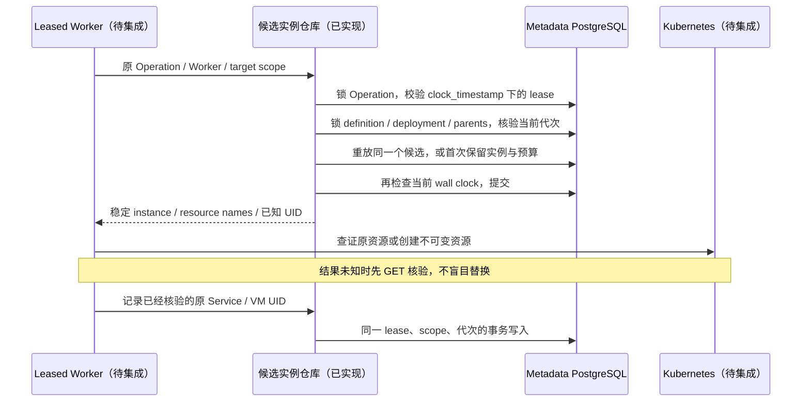

# Functions Driver：持久候选实例与租约

## 1. 结论与范围

`api/internal/control/functions_instances.go` 已实现候选实例的 PostgreSQL 仓库。
它是后续 Functions Driver 的实际内部代码，尚未注册为公共部署接口，也尚未被
Worker action 调用。当前部署镜像 `f256408` 不含本阶段新增代码；对应运行能力
仍以镜像锁和具体验收记录为准。`capabilities.functions.enabled` 保持 false。

本阶段解决：lost reply / Worker 重启沿用同一个候选身份、当前 Operation lease
及父资源准入、代次前进拒绝旧写入、部分资源 UID 的持久观察、失败 VM 保留配额。
它不证明 Kubernetes 资源所有权、guest 健康、真实 SQL 或物理退休；这些证明必须
由下一步 Driver 在实际外部系统完成。

## 2. 内部合同

| 方法 | 输入 | 持久结果与约束 |
| --- | --- | --- |
| `reserveFunctionInstance` | Operation、Worker、Function/Project/Branch/Deployment/generation/slug | 同 scope 的 provisioning/starting 行直接重放；首次生成随机 fni/VM/Service/bootstrap 身份并把部署推进至 building |
| `recordFunctionInstanceResources` | 相同 lease/scope、instance、已核验的可选 VM/Service UID | 可以先记录一个资源；两个 UID 都存在后才变成 starting；已有 UID 不可替换，不清除原值，不声称 ready |

Scope 使用原生 16 hex 身份。父 project 必须为 ready/managed，branch 为 ready，
Writer 必须为未删除的原生 read_write Endpoint。definition 不得处于删除中，
target deployment、代次、slug 和 Operation 所属关系必须一致。资源观察中的 UUID
只做格式和不可变校验；调用者还必须核验集群内实际所有权，不能把格式正确视为可信。

## 3. 事务与故障行为

事务不调用 Kubernetes、HTTP、SQL guest 或对象仓库；每次最多 5 秒。Operation 行
锁在前，父 intent 行锁在后，最后由 migration 019 的数据库预算 guard 串行准入。
提交前用 `clock_timestamp()` 重新核验租约，避免 `now()` 的事务开始时间接受一份
在等待行锁期间已经过期的 lease。

并发调用、丢失结果后重试和重新创建 server 对象均返回原 candidate。failed/draining
行继续占据全局 2 个 VM 的预览预算；仓库不提供“健康失败即释放配额”的快捷方法。
已失败的原实例不能被这个方法自动替换。错误采用固定机器语义，不返回 SQL、私有
Secret 或底层错误文本。

## 4. 验证与集成要求

实际 PostgreSQL 测试文件 `functions_instances_integration_test.go` 验证：

1. 持久身份、部署 building 状态和 Worker 重启重放。
2. 多个数据库连接并发重放只形成一个实例。
3. 旧 Worker / 跨项目 / 跨分支拒绝。
4. 部分资源观察、原 UID 恢复、替换 UID / 无效 UUID / 旧 lease 写入拒绝。
5. 实际 `pg_stat_activity` 观察到 definition 行锁等待，租约在等待期间过期后拒绝提交。
6. failed VM 保留预算；超出预算拒绝，原失败实例不隐式替换。
7. 新代次建立后，原候选及原资源观察均拒绝。

这些测试只使用专用 control_ci 的独立 schema。没有插入“真实运行函数”到业务
metadata，也没有把测试中的资源 UUID 当作集群证明。实际 Linux 测试结果必须附在
版本验收中；代码存在本身不代表通过。

2026-10-11 实际 Linux Job `dataapi-quality-20261011022249` 全量结果为
515 Go/PG pass / 0 fail / 0 skip，包含上述 7 个子场景和真实行锁等待。源码归档
SHA-256 为 `9c267d18d6f395ee6818a769fc8061edcfad84a77f62b8bd68e86407d95ea299`。
这不是 Functions 部署/调用或外部 fencing 的产品验收。

下一步依次接通不可变 artifact/env/SQL Secret、Worker 私有 CA、实际 K8s 所有权
查证与创建、真实 guest TLS/status/SQL、旧实例排空和正常 UID 退休、原子发布、
UI ZIP/config-only/调用/回滚与冷醒。公共 OpenAPI 只有实际注册的接口，不能先发布
一个没有执行 Driver 的部署 API。多 Worker / 多 ingress 的外部栅栏仍是独立门槛。
