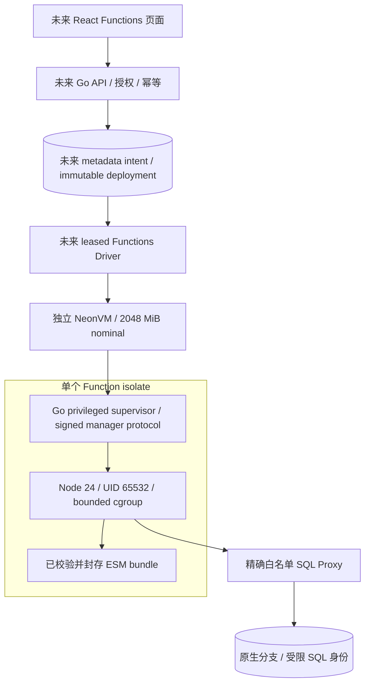

# Functions：执行基础层与后续产品闭环

## 1. 目标、官网依据和当前结论

目标是与 Neon 分支一起演进的实际 Node.js 24 服务：在独立 NeonVM 内运行客户
bundle，通过 branch-specific DATABASE_URL 访问受限 SQL，支持请求/响应、流式、
后台收尾、版本与分支生命周期。主依据为官方 [overview](https://neon.com/docs/compute/functions/overview)、
[runtime limits](https://neon.com/docs/compute/functions/reference/runtime-limits) 和
[deploy](https://neon.com/docs/compute/functions/deploy)。已核验在线 website 源码：
overview 更新 2026-10-02，limits 更新 2026-09-16，deploy 更新 2026-10-09；
本地历史快照日期与这些在线版本分开记录。

**本增量是有可运行代码和 Linux 测试的基础层，Functions 产品能力仍禁用。**
Go guest supervisor 和专用镜像构建源码已补齐，详见 [guest 合同和构建](FUNCTIONS-GUEST.md)。
镜像发布/真实 VM 验收、metadata/分支 Driver、Console
部署/调用、真实 microVM 隔离和缩零验收。没有 Functions API/Worker 集成就不能
把下面内部协议宣称为已可用的公网服务，当前 OpenAPI 仍为 0.10.1 / 87 操作。

本次精确源码的 Linux foundation Job 为 `functions-foundation-20261010203931`：
49 项 Go（race/vet，0 fail / 0 skip）和 9 项真实 Node HTTP/SSE 检查通过。原 ZIP
损坏样本误改 Deflate padding、未改变 payload 的失败回执保留；改为 Stored
payload 的确定性 CRC 损坏负例。新增 path `..`、保留键、代次/重放/redirect/
关闭失败重试等检查。这些结果只对基础层有效，不放行真实 VM 或 Functions UI。

Foundation 提交 `5bb6c5c` 的公开 Linux CI `38084887655` 全部 13 作业成功，
完整 Go/PostgreSQL 432 pass / 0 fail / 0 skip。后续 supervisor Linux Job
`functions-foundation-20261010212911` 为 74 Go / 9 Node pass，阶段区分见 guest 文档。

已实现源代码：`api/internal/functions`、`api/cmd/function-supervisor`、
`services/functions/runtime`、`services/functions/guest` 和各自测试/构建输入。
Go 提供 bundle 校验/安装、严格实例模型、管理签名/重放拒绝、固定 loopback 调用、
流式转发、关闭重试及 guest 边界 primitives。Node 提供 Fetch/HTTP/SSE/
waitUntil 执行；其宿主是独立 guest，不能放进共享 API/Worker 进程执行客户代码。

## 2. 架构与边界



目前 Go 包可独立调用，Node runtime 可在 Linux 启动并接收真实 HTTP，guest
引导源码已实现；图中的“未来”框和真实镜像/实例验收仍待完成。测试 peer 验证管理协议，不代表微虚机、租户
逃逸、网络负例或生产外部栅栏已验收。

### 2.1 代码包与环境

- slug 不可变，`^[a-z0-9]{1,20}$`；runtime 固定 nodejs24。
- ZIP compressed ≤8 MiB、expanded ≤16 MiB、每 file ≤8 MiB、最多 128 entries。
  只允许 regular files，恰好一个 index.mjs 或 index.js；拒绝目录项、symlink、
  traversal（包含独立 `..`）、重复路径、file/directory 冲突、控制字符及加密 ZIP。
- 校验真实长度/CRC 后计算 archive SHA256；所有校验完成才创建文件。os.Root
  限制安装目录，已有同 digest 目录拒绝收编；文件 0444、目录 0555。实际 guest
  安装者必须是 root，Node 不拥有这些目录。平台 artifact 存储和版本发布仍未接入。
- 客户 env 最多 32 keys、每 value ≤8192 bytes、总量 ≤32 KiB；拒绝 NUL 和
  DATABASE_URL/NODE*/PG*/NEON_*/PLATFORM_*/PATH/HOME 等平台覆盖。错误不含值。
  完整 Secret 版本/轮换与分支复制 Driver 尚待实现。

### 2.2 进程与网络

Guest primitives 要求 cgroup v2：Node 1536 MiB、swap=0、pids=64；剩余 nominal
2048 MiB 容纳 supervisor/guest 开销。setpriv 使用 UID/GID 65532、清组、
no-new-privileges、移除 bounding/inherited/ambient capabilities；从 fork 即置于
cgroup，取消时 kill 整个 cgroup，避免 detached 子进程逃避回收。

IPv4 UID-owner 默认拒绝，精确允许 loopback、指定 Proxy IP/端口、指定 DNS。
可选 public HTTPS 在 private/link-local/metadata/reserved 地址拒绝之后放行，
每个 packet 验证，不能用 DNS 初次解析替代网络边界。当前 own-fork kernel 有
IPv4 owner matcher，无 IPv6 filter；因此 guest 必须先禁 IPv6。

**这些是代码边界，仍须在真实镜像/guest 验证。** CNI NetworkPolicy 对 NeonVM
extra VXLAN 网络不足以单独证明隔离。Bootstrap Secret CD-ROM 必须加载后卸载，
核对 raw device 权限，manager/CA 私钥不进入 Node env/文件可读范围。guest marker
只用于拒绝错误启动位置，不是可信启动/远程证明。全链路 TLS 仍是独立门槛。

## 3. 已实现内部 manager v1 合同

实例 Scope 的不可变字段：instance_id=`fni_<16hex>`、deployment_id=`fdp_<16hex>`、
project_id、branch_id、slug、generation≥1。每次 manager 创建生成独立随机 boot_id；
旧 boot 的 invoke/shutdown 不能作用于新实例进程。manager key 32–128 bytes，
每个实例独立，不是租户或控制 API 的全局身份。

每次请求 HMAC-SHA256 绑定 method、精确 URI（含 query）、body SHA256、Unix time、
128-bit random nonce。窗口 ±30s；并发重放恰好一份成功；nonce cache 满时拒绝，
不驱逐有效记录。缓存是进程内边界，外部 epoch fencing 仍未完成。传输必须配
受信 TLS；仅签请求不能证明网络对端，也不能替代证书校验。

| Endpoint | Input / Output | 不变量 |
| --- | --- | --- |
| GET `/internal/v1/status` | 空 body；Scope、boot_id、root active/draining/last_activity、受限 Node health 观察 | 必须签名；Node counters 明确 untrusted，不能据此认证缩零栅栏 |
| POST `/internal/v1/invoke` | strict JSON：boot_id、generation、method、url、headers、base64 body；原 Response/stream | exact branch/slug URL scope；body ≤1 MiB、envelope ≤2 MiB、headers ≤16 KiB；16 inflight、429 Retry-After |
| POST `/internal/v1/shutdown` | strict JSON boot_id/generation；204 或失败 envelope | 立即关闭新 admission；真实 stop callback 必需；失败保持 draining，后续原实例 stop 可继续；完成后重放幂等 |

invoke 只访问构造时固定的 127.0.0.1 runtime，不接受任意内部目标；不跟随客户
302 redirect，过滤 hop-by-hop 和 x-neon-* 管理 headers，转发时逐块 Flush。
方法仅 GET/HEAD/POST/PUT/PATCH/DELETE/OPTIONS。认证失败 401、oversize 413、
非法 scope/JSON 422、draining 409、capacity 429、runtime unavailable 502、
未完成 shutdown 503；错误不暴露 key、body 或底层日志。

```mermaid
sequenceDiagram
  participant D as 未来 trusted Driver / ingress
  participant M as Go manager
  participant N as Node Fetch runtime
  D->>M: signed GET status
  M-->>D: immutable scope + fresh boot_id
  D->>M: signed invoke / boot_id / generation / original URL
  M->>M: verify MAC/nonce/scope; reserve active admission
  M->>N: fixed loopback request / bounded body
  N-->>M: Response / SSE chunks
  M-->>D: unbuffered response chunks
  M->>M: release active admission
  Note over M,N: waitUntil remains pending in Node; not a trusted external ledger
  D->>M: signed shutdown for this boot/generation
  M->>M: mark draining; reject new invokes
  M->>N: actual graceful stop callback (future supervisor)
  M-->>D: success only after callback, or explicit retryable failure
```

## 4. Node 合同与已知差异

ESM default object.fetch 或 bare async function 使用标准 Request/Response。
HTTP body bounded、16 并发、SSE 实际逐块送达。独立 self-hosted waitUntil helper
立即捕获 rejection，响应后保留 pending 计数，最多 64 注册；错误仅计数，不抛出
客户 exception 原文。SIGINT/SIGTERM 启动有界关闭。

目前 wrapper 是总计 15 分钟 deadline；官网的 TTFB/stream silence/background
是独立预算，不能声称已匹配。WebSocket、trigger、custom domains、官方 SDK
兼容尚未实现。客户代码可修改自己 Node 进程，Root manager 不把其 health 当作
可信安全断言；独立 supervisor 必须另实施超时和整个 cgroup 结束。

## 5. 退出条件与下一步（仍待交付）

| 顺序 | 实现内容 | 必须留下的真实证据 |
| --- | --- | --- |
| F1 | supervisor、签名 artifact、受信 TLS、镜像构建源码已实现；真实 build/VM 待验收 | 实际隔离 VM、Node fetch/SQL、Secret/raw-device/UID/cgroup/egress 负例、终止树 |
| F2 | immutable bundle/Secret/deployment intent、leased Driver、quota、严格 OpenAPI、React 编辑/部署/调用/日志 | UI lost-202 幂等、失败保留旧版本、版本回滚、实际 Response/SSE、正常 VM 回收 |
| F3 | 受限 SQL login、branch SQL manifest、克隆/历史点继承、zero/wake、Writer 删除依赖 | 新 branch URL/role/key；父子 SQL/代码/Secret 隔离；首次请求冷醒 Function 和 Compute |
| F4 | WS、独立预算、cron/对象 outbox、dedup/retry、完整生命周期和监控 | 真实 WS、event delivery 语义、分支旧事件隔离、触发失败恢复、持久日志/指标 |

F2 的前置实现新增 `InstanceClient` 和 `DeploymentSnapshot`。前者固定 private
Service IP / port 9090，显式 CA / instance SAN / TLS 1.3，校验完整 Scope/boot /
root status，不跟随 redirect、不自动重试 POST；流 body 生命周期由 ingress
调用者负责。Linux真实 TLS/manager/stream/cancel 检查通过。后者支持首次 ZIP /
config-only 复用代码、env merge/delete 和重启后 ownership-verified Secret
hydration；JSON 只包含代码摘要/大小及 env key，私有 byte/value 不进入 Operation。
这些是 Driver/API 的前置层，还未接入公共部署 API 或 UI。

2026-10-11 Linux `functions-deployment-boundary-quality-attempt3`：84 项 Go
检查和 9 项 Node 检查通过，包含实际 TLS、流式响应与取消；ZIP/config-only/
env merge/delete、不可变快照和重启恢复；密钥值、代码、branch、slug、If-Match
均绑定到域分离 HMAC 请求指纹，避免只哈希公开 JSON 而忽略密钥轮换。
该结果是基础层验证，真实 microVM/SQL/UI/租户配额仍有独立门槛。

官网允许用户覆盖部分自动注入服务变量；本版本为分支绑定和进程边界保留
DATABASE_URL、NEON_*/NODE*/PG*/PATH 等名称，**当前兼容差异**明确保留。
正式产品扩展须区分可覆盖的应用服务配置与不可覆盖的 supervisor/OS 凭据，
并对用户自定连接重做授权/egress 评审，不能把保留键校验直接删除。

metadata 目标：Function definition 唯一 `(project_id,branch_id,slug)`；immutable
deployment 引用 content hash 与独立 env Secret version；instance 引用 deployment/
generation/VM UID/boot；invocation ledger 与 admission/epoch 同步。分支内 SQL
manifest 是历史/克隆解析来源，不能用父分支当前 metadata 覆盖历史快照。对象
trigger 应使用与分支目录写入一致的 SQL outbox，不声称跨库 exactly-once。

每阶段提交实际实现、Linux CI、own digest 镜像、Helm/schema/版本锁与真实 UI。
未通过 F1–F3 前 capabilities.functions 保持 false；基础层检查不计入 146 项
已部署产品回归，也不替代 23 项原失败恢复。外部模型凭据不阻止这些本地步骤。
