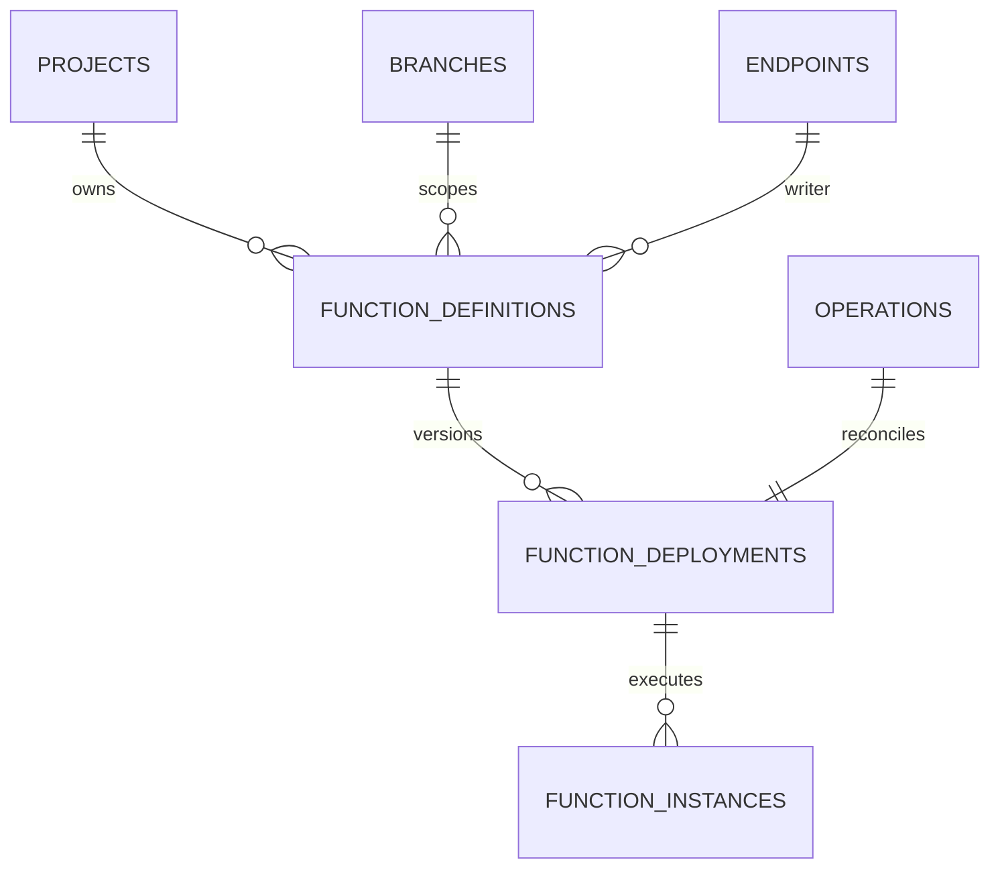
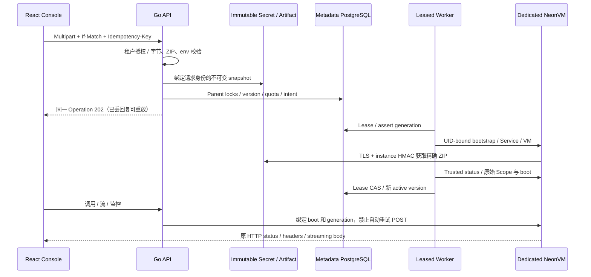

# Functions 元数据与部署准入

## 1. 目标和实现范围

目标：同一个分支上的函数可以保留历史部署、部署新代码或仅更新 env、失效恢复、
缩零后冷醒；新版本失败时原 active 版本仍可提供服务。新分支必须形成自己的实例、
URL、SQL role 和管理密钥。官网最新 [deploy](https://neon.com/docs/compute/functions/deploy)
文档更新日期为 2026-10-09，支持 Node.js 24、multipart ZIP、config-only 和不可变 slug。

当前已实现：`migrations/019_functions.sql`、真实 PostgreSQL 隔离/并发测试；
`DeploymentSnapshot`、`RequestFingerprint`、`InstanceClient` 和内存内 multipart 校验。
公共 Functions 只读 API/React 定义与历史页面已接入；SQL 权限库见 [SQL 合同](FUNCTIONS-SQL.md)。
**部署/调用 API、Worker Driver、SQL manifest 与 UI 函数执行尚未接通。**
此模型是下一阶段可执行的数据库基础，不使 capabilities.functions 变为 true；
当前 OpenAPI 0.11.0 / 90 操作只增加三项实际只读接口；未接通的执行接口不能写进合同。

本次迁移是 forward-only。上线前备份 metadata；不删除历史 migration、原 Python
归档、业务 branch、Secret、ZIP、WAL 或 PVC。新建数据表不自行创建 VM。

## 2. 数据模型

### 2.1 function_definitions

| 字段 | 类型 / 约束 | 含义 |
| --- | --- | --- |
| id | `fnc_` + 16 lowercase hex | 函数稳定身份，不能复用通用 24 hex newID |
| org_id / project_id / branch_id | text，复合外键 | 所属租户/项目/分支；拒绝跨项目挂接 |
| endpoint_id | text，复合外键 | 分支 Writer 身份；API/Driver 必须另核验 read_write/native/ready |
| slug | 1–20 lowercase alnum | 分支内唯一、创建后不可变；历史 slug 当前保留占位 |
| database_name / sql_schema | PostgreSQL identifier ≤63 | 初次明确授予的 SQL 范围；改动需要独立权限迁移 |
| sql_role | `fn_` + 16 hex，分支内唯一 | 单函数受限 login；密码/SCRAM 不在 metadata |
| version / generation | positive bigint，只能递增 | UI If-Match / 调谐代次；含义不能合并 |
| active_deployment_id | nullable scoped FK | 已接受流量的版本；active 状态必须非 null |
| target_deployment_id | nullable scoped FK | 正在调谐的新版本；失败不覆盖 active |
| state | provisioning/active/suspended/degraded/deleting/deleted | 期望生命周期；runtime readiness 必须另观察 |
| idle_timeout_seconds | 30–3600，默认 60 | 自动空闲关闭策略，待 Driver 实现 |
| created_at / updated_at / deleted_at | timestamptz | 删除保留历史；deleted 与 deleted_at 一致 |

`(project_id,branch_id,slug)` 保留唯一约束，包括已删除定义。重用同名 slug 是
后续生命周期设计项，当前不会隐式覆盖历史版本。retired definition 不可重新启用。

### 2.2 function_deployments

| 字段 | 类型 / 约束 | 含义 |
| --- | --- | --- |
| id | `fdp_` + 16 hex | 不可变部署版本 |
| function_id / project_id / branch_id | scoped FK | 完整所属关系；禁止借用 sibling 的 deployment |
| runtime | 仅 nodejs24 | 不接受旧 Node/Python 或客户覆盖启动程序 |
| bundle_digest / bundle_bytes / entry | SHA256、1–8 MiB、index.mjs/js | 完整 ZIP 原始字节摘要/大小/入口 |
| artifact_key | bounded text ≤240 | 专用对象仓库键；Driver 必须校验项目/分支前缀 |
| environment_secret_ref | bounded Kubernetes name | immutable、ownership-verified 独立 Secret |
| environment_names | sorted unique text[] ≤32 | 公开 key 名称；不含 values |
| actor_id / operation_id | FK，Operation 唯一 | 原始提交者和可恢复调谐身份 |
| state | pending/building/completed/failed | 不逆向退回 pending；终态整行不可改 |
| failure_code | optional bounded machine code | 固定错误码，不能存客户日志、密钥或错误原文 |
| created_at / finished_at | timestamptz | completed/failed 必须有 finished_at |

content、Secret ref、环境 key、actor、Operation、时间等不可在原部署行上改写。
config-only 部署仍生成独立版本/Secret snapshot，保持旧 ZIP digest，保留旧版本回滚
所需 Secret 和 artifact。`RestoreDeploymentSnapshot` 对读取到的 Secret key 集合做
再次校验，但所有权/UID 和租户授权仍须由 Driver 校验。

### 2.3 function_instances

| 字段 | 类型 / 约束 | 含义 |
| --- | --- | --- |
| id / deployment_id / function_id | `fni_` + 16 hex；scoped FK | 单次运行实例，绑定固定部署 |
| generation | positive bigint | 原始调谐代次，不能修改 |
| vm_name / service_name | `fn-{instance hex}` | 与 id 一致；不会凭可变名字收养旧 VM |
| bootstrap_secret_ref | `{vm_name}-bootstrap` | 一实例一 bootstrap；运行前卸载 Secret CD |
| vm_uid / service_uid | optional UUID，记录后不可变 | 原资源身份；未知写入结果先观察，不直接换 UID |
| boot_id | optional 32 hex，记录后不可变 | Root manager 实际启动身份，不能用新 boot 完成旧关闭 |
| state | provisioning/starting/ready/draining/failed/retired | failed/draining 仍持有容量 |
| last_invoked_at / created_at / updated_at | timestamptz | 运行与 idle controller 输入；不替代真实 inflight |
| retired_at | timestamptz | 仅 retired 有值；终态不可重新启用 |

ready/draining 必须拥有 boot、VM UID、Service UID。一个函数最多一个 ready 和一个
candidate（provisioning/starting）实例。部署切换先 drain 原 ready，再提交新 ready；
需要事务和真实 Root 回执，不能仅修改这两个字段来宣称关闭成功。

## 3. 并发、配额和删除边界

目前预览集群的 metadata 容量为 8 个未删除定义、2 个未 retired VM。PostgreSQL
advisory transaction locks 在数据库内串行准入，真实多连接测试争夺最后一个 slot，
只准入一个请求。此项证明 metadata 预算，不是外部 Compute Proxy 栅栏/HA 准入。
生产扩展要引入数据库内权威 region/org quota，不能让不同 API 的 env 值各自决定容量。

lease 超时、Pod health 失败、Node crash、manager 不可达均不能释放 slot。Driver
必须按保存的 UID/resourceVersion 正常删除 VM，并观察所有同实例 Runner absent；
node lost 的未知物理状态需要单独 fencing/recovery，不能 force-delete 来假装完成。

现有删除入口先拒绝非 deleted Function definition 或非 retired instance：Writer
删除检查其关联函数；branch/project 检查整个删除范围。独立 reader 删除不因 Writer
的函数而被拒绝。此拒绝门槛在 verified Functions retirement Driver 完成后才可
替换为整合调谐步骤。

## 4. 部署流程（API/Worker 尚待接通）

`ParseDeploymentRequest` 只接受一个 zip/runtime/environment 字段，env 为 JSON
string map；禁止重复 field/key、null/non-string 值、bracket fields、transfer encoding、
未知字段、无界 chunked 请求。输入在有界内存中处理，不写 API 临时盘；不执行代码。
最大请求为 8 MiB ZIP + 256 KiB JSON escaping/framing，展开最多 16 MiB / 128 files。

幂等 fingerprint 必须使用带平台私有 key 的域分离 HMAC，包含 code hash、私有
env values、project、branch、slug、If-Match。JSON serializer 故意隐藏密钥，不能
用于计算请求哈希；JSON 字段相同不表示私有 env 相同。

客户端部署重试与业务 POST 调用重试必须分开：部署按原 Idempotency-Key 返回原
Operation；invoke 执行结果未知时不得自动重放。ingress 要另外实现并发/epoch admission，
这些表本身不能保证整条网络链路只有一次执行。

### 4.1 必须分离浏览器 origin 与平台凭据

公网 Functions 返回客户 HTML/JavaScript，必须与 Console 的可信 origin 分离。
单纯使用同一 IP 的不同端口不能分离 Cookie 的 host 范围；不能直接把 untrusted
Function HTML 挂到 Console 的 `/functions` 路径来声称产品可用。独立 functions
hostname、明确 Host/TLS、Cookie boundary 和 exact-origin CORS 是启用前的门槛。
平台 session/CSRF/management headers 不进入 Function，客户 Set-Cookie 不得覆盖
Console 凭据。无域名实验环境可以先提供授权的 JSON/text 调试调用，React 以文本
渲染结果；不能使用 iframe srcdoc/innerHTML 执行客户响应，也不能虚标公开 URL。

`GuestIssuer` 是新增 Worker 前置库：读取单一 valid root CA 与匹配强 PKCS8 key，
为精确 instance SAN 签发每次独立 P-256 leaf / serial，期限 30 分钟至 4 小时、
不得越过 root 期限。`GuestIdentity` JSON 不含 leaf private key。API 只能挂载
artifact listener 自己的 leaf，不应得到 Worker CA signing key。此库不创建平台
Secret，也不证明平台已启用 at-rest encryption/PKI rotation 或全链路可信 TLS。

## 5. 验收与下一阶段

Linux 全量 `functions-metadata-full-linux-quality-attempt1` 为 471 Go pass / 0 fail /
0 skip。实际专用 PostgreSQL schema验证复合租户外键、部署内容/终态不可变、最后
VM slot 并发争用、failed 保留 slot、正常 retired 才可再次准入和实例 UID 不可替换。
multipart foundation 为 87 Go / 9 Node pass。后续
`functions-boot-metadata-full-linux-quality-attempt2` 为 474 Go pass / 0 fail /
0 skip，追加了 default-route 等待与已授权 Writer/branch/project 删除拒绝检查。

下一阶段必须实现并验收：immutable artifact/Secret 写入结果恢复、SQL login/schema
权限、leased Driver、真实函数部署/失败保持旧版本/回滚/缩零冷醒、严格 OpenAPI 和 React
部署调用/日志页面；随后验证 SQL manifest 的 branch/PITR 继承。未完成项不是“只差测试”。

所有证据保留源 commit、artifact digest、Job/VM/Pod UID、Scope、boot、真实正负检查及
正常退休回执。内部 peer 和模拟 K8s 回执不计入实际 Functions UI 或生产隔离验收。
