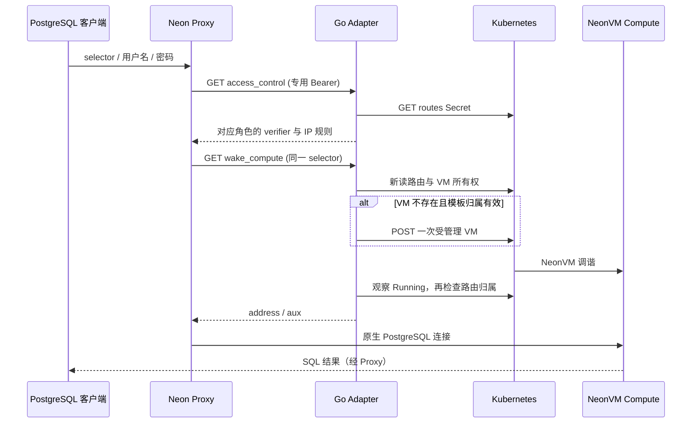

# Go Proxy / Storage 适配器

## 1. 范围与真实状态

`api/cmd/control-adapter` 是独立 Go HTTP 进程，`Dockerfile.adapter` 生成
非 root、无解释器的 scratch 镜像。它替换早期 Python 适配器，API/Worker 仍然
使用 PostgreSQL；React/TypeScript 控制台无需更换语言或接口。

协议以维护者锁定的 Neon `1f30cd02092d` 为准，来源是该版本的
`proxy/src/control_plane/client/cplane_proxy_v1.rs`、`messages.rs`、
`storage_controller/src/compute_hook.rs` 和 `service.rs`。这是内部适配合同，
不声称实现托管 Neon 控制面 `/api/v2` 或 Managed Auth JWKS。

Go 故障测试已经覆盖认证、所有权、重复唤醒、未知写入结果、通知版本和容量边界。
镜像部署、真实 Proxy 和 UI 测试须使用同一提交的独立回执。单进程锁不是分布式
缩零栅栏；版本仍为预览。当前支持锁定单节点、无分片存储布局，不自动接受
Pageserver 迁移或活跃租户的 Safekeeper generation 重配置。

## 2. 调用流程

## 3. HTTP 合同

除探针及固定指标外，入口均验证独立 Bearer。错误仅返回稳定错误代码，
不会返回 Kubernetes 响应正文、凭据、verifier 或 VM 模板。

| 方法与路径 | 调用方 / 输入 | 正常结果 | 主要失败 |
| --- | --- | --- | --- |
| GET `/healthz` | kubelet | `status:ok,runtime:go,process_role:proxy_adapter,distributed_fencing:false` | 进程不可用 |
| GET `/readyz` | kubelet | 验证凭据文件、routes Secret、receipt ConfigMap 可读 | 503；不写资源 |
| GET `/metrics` | 集群指标采集 | requests / failures / cold_wakes / wakes_in_flight | 无租户、角色、Token 标签 |
| GET `/cplane/get_endpoint_access_control?endpointish=<selector>&role=<role>` | Proxy Token；单一 selector/role | `role_secret`、`allowed_ips` | 400 非法输入；401；404 无路由/角色；503 依赖失败 |
| GET `/cplane/wake_compute?endpointish=<selector>` | Proxy Token | `address` 及 `aux`：endpoint_id/project_id/branch_id/compute_id/cold_start_info | 400；401；404；503 拒绝、未知结果或超时 |
| GET `/cplane/endpoints/{endpoint}/jwks` | Proxy Token | `jwks:[]`，保持锁定版本的空 JWKS 合同 | 401；不宣称支持 JWT 数据库登录 |
| PUT `/notify-attach` | Controller Hook Token | 200 `status:applied`；幂等 receipt | 400 非法负载；401；423 未支持布局；503 依赖/CAS/容量失败 |
| PUT `/notify-safekeepers` | Controller Hook Token | 200 `status:applied`；旧代次忽略、相同代次内容必须一致 | 400；401；423 活跃租户新代次；503 冲突 |

`cold_start_info` 为 `warm` 或 `pool_miss`，匹配锁定 Proxy Rust 枚举。
唤醒队列满时返回 503 和 `Retry-After: 1`。返回 Running 只满足 Proxy 路由观察，
控制面异步 Operation 另执行 SQL 就绪探针，不能用 Running 代替 SQL 成功。

## 4. 权威状态与安全边界

* 路由仅来自指定 `neon-control-routes` Secret 的 `routes.json`；adapter 不创建、
  重置或删除该 Secret。角色轮换由控制面维护，不能复制旧 verifier 覆盖新状态。
* 地址必须为同一 namespace 的受信任工作负载 Service，端口固定 55433；拒绝外部目标。
* VM 模板必须匹配 namespace、项目、Endpoint、name、kind 和 apiVersion；不能带 UID、
  resourceVersion、deletionTimestamp 或 status。已有 VM 必须有非空 UID 和一致归属。
* 每次唤醒只发一次 POST。409 后读取并验证实际 VM；未知写入结果直接失败，不能盲重试。
  GET 仅对少数瞬时网络错误重试一次；HTTP/TLS/JSON 错误、取消和所有写操作不自动重放。
* 写入前和返回前重新读路由，拒绝关闭或已替换身份。检查与外部动作之间仍有间隙，
  因而不支持多实例放行；跨实例连接账本、epoch admission 和删除竞争是独立后续工作。
* 保留导入的旧静态 VM 路由只观察，不重新创建已经退休的静态 VM；旧 Deployment 路由
  通过带 resourceVersion 的 `/scale` 唤醒。它们属于显式兼容路径。
* attach 先通过 Kubernetes Service proxy 查询原生 Controller 的真实 node_attached，
  只接受当前无分片节点；需要 `services/proxy` 对精确 Service 的 GET 权限。
* 通知保存于原 ConfigMap `receipts.json`，使用 resourceVersion CAS、最多六次冲突重读，
  不重放未知 PUT；保留其他字段。比较 canonical payload 以兼容旧 Python JSON hash。
  safekeeper ID/generation 保留 uint64 精度；最多 64,000 字节输入、512 KiB receipt 内容，
  超限失败且不自动驱逐历史。未来迁移 PostgreSQL receipt ledger 需单独的可恢复迁移。

## 5. 配置与部署

| 环境变量 | 默认 / 约束 |
| --- | --- |
| `NEON_ADAPTER_BIND` | `:8080`，内部 Service |
| `POD_NAMESPACE` | Pod namespace |
| `ROUTES_SECRET` | `neon-control-routes` |
| `NOTIFICATIONS_CONFIGMAP` | `neon-control-notifications` |
| `PROXY_API_TOKEN_FILE` | 挂载 Secret 的 `proxyToken` 文件 |
| `CONTROLLER_HOOK_TOKEN_FILE` | 另一 Secret 的 `token` 文件 |
| `NEON_ADAPTER_WAKE_TIMEOUT` | `300s`，大于 0 且不超过 5 分钟 |
| `NEON_ADAPTER_MAX_WAKES` | 8，范围 1–64 |
| `NEON_ADAPTER_PAGESERVER_NODE_ID` | 2，必须与实际存储布局一致 |

凭据文件逐请求读取，支持 Kubernetes Secret 原子轮换；文件不可读即拒绝访问，
不会退回旧值。两个凭据必须非空且不同。迁移期间支持同名无 `_FILE` 的环境值，
标准 Helm 使用文件方式。Kubernetes CA 与 ServiceAccount Token 使用投影文件并校验 TLS。

统一 Chart 位于 [neon-helm](https://github.com/william-lbn/neon-helm) 的
`charts/neon-adapter`。必须固定本次 CI 发布 digest，单副本 Recreate 升级，保持
原 Service 名与 selector，并保留 routes、receipts、Proxy/Hook Secret。
升级前保存完整 Helm values、manifest、资源 UID 及 SQL/UI 基线；Worker 排空后
维护窗口切换。失败时先确认请求/写入结果，再恢复原固定镜像与完整 values，
禁止重置 Secret、receipt、PVC、WAL 或对象数据。

## 6. 验收与维护

Linux CI 使用标准 `go test -race ./...`、真实 PostgreSQL、零跳过规则及源码边界检查；
新 adapter 测试使用可控 Kubernetes 协议替身覆盖具体失败分支。真实验收另从浏览器
创建项目/分支/Reader、SQL 经 Proxy、0→1 冷醒、1→0 停止、密码轮换、历史恢复、
Data API、邀请授权和 Worker 故障恢复。每次版本保留失败与重试 evidence。

发布归属是控制面仓库的第六个镜像 `control-adapter`，与其他镜像同一 SHA、
独立 SBOM/provenance。Python 私有 SSH/浏览器驱动/证据工具不进入本仓库；
历史 Python 运行实现只作为受保护的旧版回滚来源，不应继续作为新产品运行组件。
