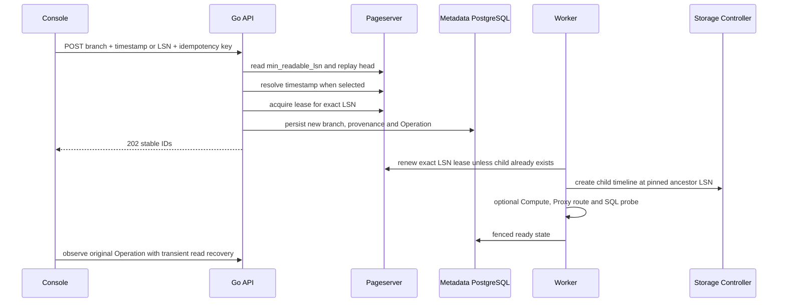

# Historical branch restore

## 1. Scope and source contract

This increment implements PostgreSQL recovery **into a new branch**, using a
retained timestamp or WAL LSN. It does not replace an existing timeline or move
application connections. Source branches, Endpoint identities and platform
credential revocations remain unchanged. It is one part of the full PITR goal;
in-place restore with a backup branch, Time Travel Assist, retention management
and Backend-wide recovery are separate increments.

The runtime uses the pinned fork's actual Pageserver APIs, including
`min_readable_lsn`, timestamp lookup and `lsn_lease`. It does not assume a fixed
number of days of history. Relevant source contracts:

* `pageserver/src/http/routes.rs`: timeline detail, `get_lsn_by_timestamp`,
  `lsn_lease` and native timeline branching.
* `libs/pageserver_api/src/models.rs`: `TimelineInfo`, `LsnLease` and branch LSN.
* [Official branching documentation](https://neon.com/docs/manage/branches)
  and the downloaded website's `content/docs/guides/branch-restore.md`.

The current placement adapter targets the existing managed Pageserver and
unsharded laboratory tenant. Multi-shard/relocated tenants require controller
placement resolution before this Driver can claim support for them.

## 2. API and data model

The bundled OpenAPI is the authoritative, executable contract.

| API | Authorization | Behavior |
| --- | --- | --- |
| `GET /api/v1/projects/{project}/branches/{branch}/restore-window` | Project Reader, current membership/key scope | Returns actual minimum readable and latest replayed LSN; does not wake Compute or acquire a lease |
| `POST /api/v1/projects/{project}/branches` | Project Editor, CSRF for sessions, Idempotency-Key | Existing branch creation accepts either `parent_timestamp` or `parent_lsn`, never both; creates a new branch and optional Writer |
| `GET /api/v1/projects/{project}/operations/{operation}` | Project Reader | Durable queue, lease renewal, timeline, runtime, SQL verification and final state |
| `POST .../operations/{operation}/retry` | Project Editor | Retries the original resource IDs and fixed LSN; never moves the restore point forward |

`parent_timestamp` is RFC3339 with an explicit timezone. The server normalizes
it to UTC for native lookup. Future timestamps, malformed values and an LSN
outside retained/replayed history are rejected. A timestamp later than the
last replayed commit returns `409 restore_timestamp_not_replayed`; it is not
silently treated as the current state. Native `past` and `nodata` are explicit
errors. An aligned explicit LSN is still subject to native branch validation.

Migration **013** adds `branches.restore_source` (`current`, `timestamp`, `lsn`)
and `parent_timestamp`, with a consistency constraint. The existing `parent_lsn`
is the immutable resolved point. An Operation persists resource identities,
restore kind and that LSN; passwords and SCRAM verifiers stay in owned Secrets.

Examples (use normal authenticated API tooling; never publish passwords):

```json
{
  "name": "recovery-incident-42",
  "parent_branch_id": "br_source",
  "parent_timestamp": "2026-10-07T06:00:00.123456Z",
  "create_endpoint": false
}
```

For an immediate Writer set `create_endpoint:true`, supply a fresh `password`
and supported `autoscaling` bounds. The request returns `202` with the stable
branch and Operation. Database credentials are reserved only after the source
point passes validation, preventing invalid restore requests from creating
Endpoint Secrets.

## 3. Retention, replay and catalog isolation



The effective minimum readable LSN and initdb boundary are checked numerically,
not lexicographically. An applied GC cutoff is insufficient. A native lease is
required before accepting intent and renewed by the Worker before branching.
After successful branching, the child retains its ancestor point. A retry can
verify the existing child even if the source history later moves past that LSN.
Conflict adoption requires the exact ancestor timeline and LSN; a different
resource is never accepted as success. A queued Operation whose source data is
no longer retained fails rather than restoring a later point.

Historical recovery does **not** copy today's metadata role/database intents
or tombstones into old physical data. SQL inventory is read from the restored
database. Pre-existing historical custom objects appear as observed/unmanaged
objects until a separate safe adoption workflow is implemented. This prevents
roles/databases created later from being added during recovery and prevents
current deletion intents from deleting historical objects.

The new Writer receives fresh platform administrative/probe credentials and a
distinct Proxy selector. Historical application tables and PostgreSQL catalog
are recovered as physical database state; users must review historical grants
and custom credentials before exposing the recovered branch. Existing
platform application credentials, sessions, budgets and Secret revocations are
not rewound by this operation. Backend service restoration is not advertised.

## 4. Deployment and repeatable UI acceptance

Enable `api.pitrEnabled:true` in the Helm deployment **only after** storage API
compatibility and the following live slice pass. The default is false. Both API
and Worker receive the same capability setting. `pitr_new_branch` is the narrow
capability; it does not advertise complete in-place PITR or DR.

1. Preserve full Helm values/manifests, metadata dump, PVC UIDs and Secrets before
   upgrading. Quiesce API/Worker and perform the forward migration once.
2. In the Console create an isolated test project with a 1 CPU/1 GiB Writer.
3. Use SQL Workbench to create a table and write a `before` value. Record a UTC
   timestamp and committed WAL LSN.
4. Write `after`, create another table, then create a managed role and database
   through the catalog UI. Suspend the source Compute to bound resources.
5. Open **历史恢复**, select the source and recorded timestamp, and restore to
   a new branch. Follow its durable Operation and query through its Proxy entry.
6. Assert the `before` value exists; later table/role/database do not exist.
7. Write a branch-only row, suspend, cold wake through SQL, and assert persistence.
8. Query the original branch and prove it still has `after` and no branch-only row.
9. Restore the recorded LSN to another branch and verify the same historical data.
10. Replay the original creation key/body and require the same branch, Operation
    and LSN. Reject an expired history point without accepting another branch.
11. Suspend all owned test Computes. Observe both VM and Runner disappearance;
    retain database pages, catalog, credentials, manifests, logs and fixtures.

The public Linux test is `web/e2e/restore.spec.ts`, available in the trusted live
UI workflow. `NEON_E2E_POLL_FAULT=true` injects two read-only observation failures
and asserts one restore mutation. Protected inputs and evidence directories
follow `TESTING.md`; browser traces/videos/network bodies remain disabled.

The Go suite additionally tests timezone normalization, numeric LSN boundaries,
authorization, disabled capability, native timestamp result errors, exact
timeline conflict ownership, metadata isolation, replay and Worker recovery.
Its storage peer is simulated; it does not substitute for the real Linux UI gate.
