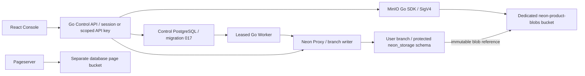
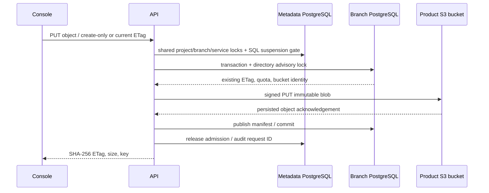

# Branch Object Storage v1

## 1. Product contract and current boundary

The implementation adds usable files to a Neon branch: Console configuration,
bucket creation, upload/download/list/prefix pagination, private or public read,
short-lived private download links, byte ranges, conditional reads, conditional
overwrite/deletion, native timeline inheritance and independent child changes.
API/Worker/Web remain separate Go/Go/React processes. No Python business service
or verification script is added to this repository.

**Protocol: `neon-object-rest-v1`. External S3 compatibility is false.** The
internal blob transport uses the maintained MinIO Go SDK with SigV4; that does
not make the public REST API an S3 server. S3 wire operations, scoped S3 access
keys, multipart uploads, bucket CORS/tagging, object triggers, physical GC and
cross-domain disaster recovery remain independent implementation/acceptance
items. Do not call this release complete Neon parity or production qualified.

Official baseline: the local website snapshot `c0d49cbb6979b2ce79ea502d62dbc40780a923b0`,
`content/docs/storage/{overview,buckets,objects,authentication,s3-compatibility}.md`,
with page updates on 2026-09-16 and 2026-09-18. The official [Object Storage architecture](https://neon.com/blog/building-neon-object-storage)
describes branch inheritance and copy-on-write file semantics. The official
[S3 compatibility contract](https://neon.com/docs/storage/s3-compatibility)
also contains operations this increment deliberately does not advertise.

## 2. Architecture and data ownership



`object_storage_instances` contains desired/observed state, generation, immutable
database selection and the branch writer reference. It contains no blob bytes,
bucket directory, access key or secret. Operations use the existing lease,
durable steps, idempotency key and lifecycle admission infrastructure.

`neon_storage.buckets` and `neon_storage.objects` live in the selected **user
branch database**, not in control metadata. Objects contain the logical bucket
and key, immutable blob key, SHA-256, size, content type and timestamp. A
schema ownership marker binds this directory to its project. Installation rows
bind access to the current branch generation. Migrations/replays do not truncate
the directory. PUBLIC receives no schema permission.

The API uses the existing protected `control_probe` identity for directory SQL.
It is a trusted control-plane provisioner, not an application login. Separating
the file gateway into its own restricted SQL runtime is a future production gate.
Application credentials must never receive this role or the backing S3 secret.
Project database administrators can deliberately alter their database; ownership
and generation checks fail closed when the control directory is changed.

Blob keys are random, project-prefixed and immutable. Upload first persists the
blob, then commits the manifest transaction. An interruption can leave an orphan;
it cannot publish a reference before the blob write succeeds. A child timeline
inherits existing manifests and references the same blobs. New child writes get
new blob keys; catalog deletion affects only the current timeline.



## 3. Lifecycle, concurrency and safety

Enable/disable requires Admin, `If-Match: "generation"`, and
`Idempotency-Key`. Exact retries return the original Operation. Enabling requires
a ready managed writer and owner delegation of `CREATE` to `control_probe` on
the selected database. A re-enable must use the original database. The worker
verifies the backing bucket, installs/verifies the directory, and commits active
state under its current lease. An inherited service is queued atomically after
the child writer becomes ready; readers never become directory writers.

Object access takes metadata locks in project → branch → service order and uses
a transaction shared advisory lock with the existing SQL idle-suspension gate.
It uses one metadata pool connection, avoiding pool exhaustion while waiting for
a second gate connection. Disable/delete waits for admitted requests and closes
new admission before retiring resources. This is **not** the unqualified external
Proxy/VM cross-instance fence.

Writes serialize on the branch directory lock. New keys require
`If-None-Match: *`; overwrites/deletes require the quoted current SHA-256 ETag.
Missing preconditions return 428; stale versions return 412. A caller must inspect
an uncertain result; the client does not retry arbitrary writes with a fresh key.
The bucket must exist, and deletion requires an empty bucket.

Limits per branch: 32 buckets, 1,000 directory entries, 100 MiB logical bytes,
8 MiB per object. At most eight admitted object requests per API process; each
has a 150-second budget, covering cold wake. These are preview quotas, not billed
usage or an organization-wide physical-byte reservation. Multi-process aggregate
rate limiting and physical usage accounting remain production gates.

Downloads verify full object size and SHA-256 before returning bytes.
`http.ServeContent` implements HEAD/Range/conditional GET. Untrusted types are
served as attachments with `nosniff`, sandbox CSP and private/no-store caching.
Object keys cannot escape directories, and a blob reference must remain under
the current project's prefix.

Private signed links bind the object blob, principal, branch, service generation
and expiry (1–900 seconds). Account and current organization/project permission
are rechecked using the held metadata transaction. A changed object, disabled or
re-enabled service, removed membership, disabled account, wrong branch, tampered
signature or expired link closes private access. Tokens are never put in reports
or access-log query strings. `public_read` permits anonymous GET/HEAD; it does not
permit writes or directory listing. Public read is intentionally public.

Logical object/bucket/project deletion retains immutable bytes, WAL and other
branches' manifests. **No physical GC exists yet.** API deletion of a database
holding a retained storage directory is blocked pending a separately verified
purge contract. Preserved orphan/old blobs must be included in operator capacity
planning and backups.

## 4. API contract

The executable contract is `contracts/openapi-v1.json` (0.10.0); Swagger is
`/api/docs`. Every registered operation has a matching contract entry.

| Path below `/api/v1/projects/{project}/branches/{branch}/storage` | Method | Result |
|---|---|---|
| root | GET | Metadata state/ETag/protocol/limits; no Compute wake |
| root | POST / DELETE | Leased enable/disable; 202 + original Operation |
| `/buckets` | GET / POST | List or create bucket with private/public_read access |
| `/buckets/{bucket}` | DELETE | Delete empty branch bucket; blobs retained |
| `/buckets/{bucket}/objects` | GET | Without key: prefix/after list, 100 entries/page; with key: bytes |
| same | HEAD | Required `key`; object headers |
| same | PUT | Binary body, required `key` and conditional write header |
| same | DELETE | Required `key` and current If-Match |
| `/buckets/{bucket}/presign` | POST | `{key, expires_seconds}` → short-lived GET URL |
| `/storage/v1/{storageBranch}/{bucket}` (public root) | GET / HEAD | Required key; public_read or valid token; no Console cookie authorization |

Console authentication and existing organization/project API keys protect manager
routes. Admin manages service configuration, Editor writes files, Viewer reads
existing directories/files. Signed-link creation uses the normal mutation/CSRF
boundary and requires Editor. Anonymous routes never treat Console cookies as
an application grant. All requests carry the existing request ID/error envelope.

## 5. Linux deployment

1. Back up existing complete Helm values, metadata, immutable Secrets, PVC state
   and image locks. Suspend only recorded test Computes via product API. Check
   every node using `tools/check-node-pressure.sh` from neon-helm; serialize builds
   and browser tests when the hosts share one physical disk.
2. Provision a **new** restricted credential Secret outside source:

   ```bash
   node tools/prepare-product-storage.mjs \
     --output /secure/operator/neon-product-storage \
     --endpoint http://minio.neon.svc.cluster.local:9000 --lab-http
   kubectl -n neon create -f /secure/operator/neon-product-storage/neon-product-blob-store.private.json
   ```

   For an existing Secret, preserve it; do not generate or apply a replacement.
   TLS operators supply a trusted HTTPS S3 endpoint. Lab HTTP is an explicit
   exception, not full-chain TLS acceptance.
3. In neon-core set `minio.productStorage.enabled=true`, bucket
   `neon-product-blobs` and existingSecret `neon-product-blob-store`. Its bounded
   hook creates the bucket and account with only GetBucketLocation/ListBucket and
   GetObject/PutObject on that bucket. It does not delete blobs or alter page
   bucket permissions. MinIO root credentials are available only to the init hook.
4. In neon-control-plane set `objectStorage.enabled=true` and matching
   `existingSecret`. API and Worker mount only config.json read-only. The schema
   rejects missing Secrets and unknown values. All images remain digest pinned.
   New unified stack deployments use the matching release profiles; existing
   deployments must preserve complete previous values and live SQL CA identity.
5. Run unified preflight/apply/verify/live audit. Validate ready API/Worker/Web,
   migration 017, restricted backing access, retained PVCs/Secrets and exact image
   digests. A failed hook must be inspected, not force-deleted or ignored.

## 6. Manual Console and automated Linux acceptance

Create a bounded project through UI. In SQL Workbench, using its database owner,
run `GRANT CREATE ON DATABASE postgres TO control_probe`; then open Object Storage
and enable it. Create a private uploads bucket, upload a text file, list it, and
download it. Confirm the SHA-256 and contents. Create a child branch through UI,
then select that branch in Object Storage. Confirm inherited contents, overwrite
the child with its current ETag, and confirm the parent remains unchanged. Delete
the child object and empty bucket; confirm parent download still works.

Suspend the writer through Compute UI. Visiting the Object Storage state page
must preserve zero. Clicking Load buckets or downloading a file cold wakes it.
Disable/re-enable the service: data remains, and an earlier private URL fails.
Create a public_read bucket to validate anonymous safe download explicitly.
Disable both services and suspend only the test's recorded endpoints when done.
Retain SQL/objects/password fixtures/evidence for repeatability.

Automated acceptance on an authorized Linux runner:

```bash
cd web
NEON_E2E_BASE_URL=http://your-console \
NEON_E2E_ADMIN_PASSWORD_FILE=/secure/e2e/admin-password \
NEON_E2E_PRIVATE_DIR=/secure/e2e/unique-attempt \
NEON_E2E_ARTIFACTS=/secure/e2e/evidence/unique-attempt \
npm run test:e2e -- object-storage.spec.ts
```

The suite starts with actual React login/project creation and checks real blob
bytes, immutable directory inheritance, concurrent CAS, private/public ACL,
tampering/range/head/304, limits, retained deletion, disable/re-enable and cold
wake. It has no retry and retains original failure evidence; cleanup acts only on
its already recorded project/endpoint IDs via normal API. Tokens, cookies and
passwords are excluded from result.json/screenshots. Private fixtures remain
outside the checkout. Run the Go real-PG/race, frontend, Helm and source boundary
gates before promoting images; never equate these gates with HA/DR/TLS approval.

The successful initial Linux UI run verified 19 checks; continuation of the original retained failure verified four recovery checks without rewriting it. Later image revisions require their own repeatable acceptance report.

## 7. Next increments

1. Unified `storage:read`/`storage:write` encrypted credentials, revocation and
   descendant policy; public S3 SigV4 server interoperability and SDK negatives.
2. Multipart/CORS/tags/conditional metadata update and object event outbox, with
   deduplication and delayed verified GC across every live/historical timeline.
3. Restricted standalone gateway, physical quota reservations, distributed rate
   limits, upload orphan inventory, restore drills and TLS/HA/DR qualification.

Functions and real AI inference remain separate services. Reusing a backing S3
bucket for files does not implement either service.

## 8. Explicit failed-fixture continuation

`object-storage-recovery.spec.ts` accepts `NEON_E2E_STORAGE_RECOVERY_FIXTURE`, a protected JSON file containing the original project/name, parent/child IDs and child name, writer IDs and original failure Job. It creates no new project. The suite re-enables the retained services through UI, verifies original bytes and edge security headers, tests retained deletion/recovery, disables services, suspends writers and leaves a retained tombstone. Validate fixture identity against the original report; never rewrite a failure or blindly create another fixture at quota capacity.
