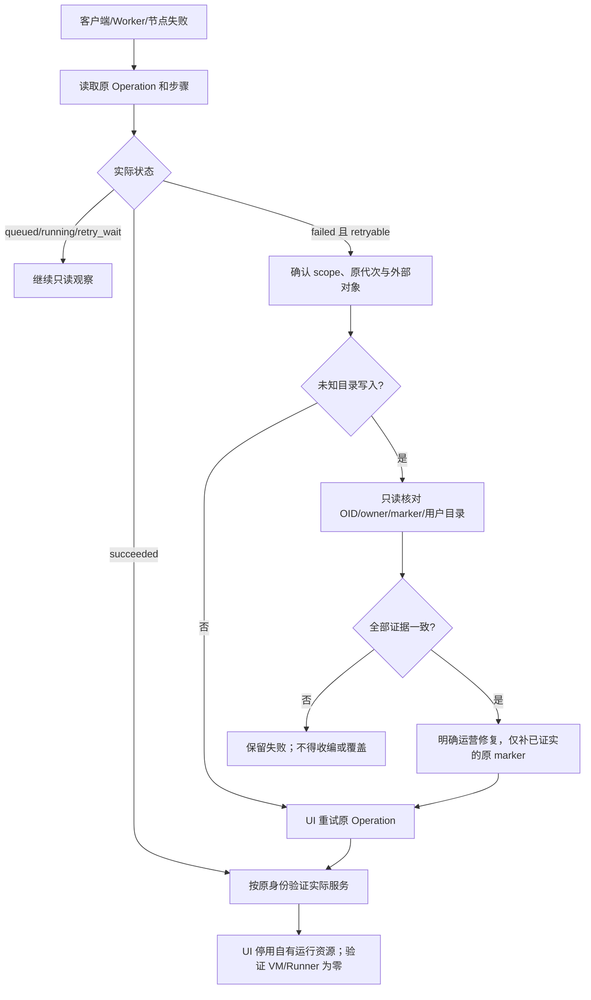

# 原 Operation 恢复与未知外部写入结果

## 1. 目标和边界

网络/Worker/节点故障后，先读取原 Request/Operation 与步骤。202 或弹窗超时不能
证明动作失败，外部 DDL 连接错误也不能证明数据库未创建。恢复保留同一资源 ID、
Operation ID、payload 与证据，避免重复创建或收编其他人的同名资源。

当前真实 UI 验收见 [Compute 生命周期交付](DELIVERY-2026-10-10-COMPUTE-LIFECYCLE.md)。
独立 DELETE、历史分支、目录数据库及原生 Writer 各自有原失败和后续恢复回执。
这不是自动未知 DDL 收编、HA 或外部 epoch fence 的生产认证。

## 2. 安全流程



1. 保存原 Job/Pod UID、请求和幂等键、项目/分支/Endpoint、镜像/源码版本、
   Operation 步骤/attempts、错误码和私密日志。不得覆盖原失败目录。
2. `GET /api/v1/projects/{project}/operations/{operation}` 只读查询。终态
   succeeded 不再次执行。running/queued/retry_wait 只读观察。failed 必须明确
   `retryable=true`；在基础依赖恢复后从 Operation UI 重试该 ID。
3. 原请求的受理结果丢失时，仅用原 Idempotency-Key、If-Match 和完全相同的
   body 重放，确认返回同一 Operation。不要生成新 key 创造重复意图。
4. `POST .../operations/{operation}/retry` 沿用身份并增加 attempts；Session
   需要 CSRF 和当前项目授权。通过后核对实际 SQL/只读属性/原 Selector/Timeline，
   不能只看步骤绿色。各资源权限及返回码以 OpenAPI 为准。
5. 对自有 fixture 停用服务并从 UI 缩到 0。等待正常 VM/Runner 退休，包括所有
   Terminating/Succeeded 残留；保留数据、WAL、blob、凭据、模板和失败记录。

## 3. CREATE DATABASE 的已知中断窗口

PostgreSQL 不允许 CREATE DATABASE 和后续 COMMENT 与控制 metadata 放在同一
事务。CREATE 已提交而 COMMENT 未完成时，重试发现同名无标记 DB，安全 guard
拒绝自动收编。当前版保持这一拒绝：仅名称或 owner 相同不构成所有权证明。

本轮只对明确的原测试对象执行了运营修复：

- 原持久 create_database 意图和数据库目录指向同一 project/branch/name/owner；
- 原始失败链、时间和 Operation ID 完整保留；未创建另一份数据库意图；
- 只读实际 SQL 取得准确 database OID、role OID、owner、空 DB COMMENT 与
  `neon-control/branch/<branch-id>` 角色 marker；受限命名与标识符已核对；
- 连接目标数据库验证 current_database 和零用户关系，不更改客户对象；
- 一个条件 DO 再检查上述 OID/owner/marker，全部匹配后只补此 DB 的 branch
  COMMENT；条件改变就抛异常；没有改名、换 owner、DROP 或通用 adoption；
- 从 UI 重试原 Operation，验证 attempts 增加、owner、源数据和最终缩零。

参考条件语句（必须先用真实私密证据填入准确值；不能复制给任意同名 DB）：

```sql
DO $repair$
DECLARE database_oid oid; role_oid oid; owner_name text; marker text;
BEGIN
  SELECT d.oid, r.oid, r.rolname, COALESCE(shobj_description(d.oid,'pg_database'),'')
    INTO database_oid, role_oid, owner_name, marker
    FROM pg_database d JOIN pg_roles r ON r.oid=d.datdba
    WHERE d.datname='<verified-database-name>';
  IF database_oid IS DISTINCT FROM <verified-database-oid>::oid
     OR role_oid IS DISTINCT FROM <verified-role-oid>::oid
     OR owner_name IS DISTINCT FROM '<verified-role-name>'
     OR marker IS DISTINCT FROM ''
     OR COALESCE(shobj_description(role_oid,'pg_authid'),'')
        <> 'neon-control/branch/<verified-branch-id>' THEN
    RAISE EXCEPTION 'Original database identity changed; repair refused';
  END IF;
  EXECUTE format('COMMENT ON DATABASE %I IS %L',
    '<verified-database-name>', 'neon-control/branch/<verified-branch-id>');
END
$repair$;
```

此 SQL 是运营流程模板，不是自动 public API。恢复自动化只在显式 fixture 中
提供 `manual_catalog_repair` 且匹配只读回执/OID/owner/marker 时执行。应在独立
受信管理窗口冻结对该 fixture 的外部 DDL；并发外部 DDL 的完整恢复仍是门槛。

## 4. Linux UI 恢复测试合同

`web/recovery/recover-operation.spec.ts` 使用严格 fixture：

```json
{
  "purpose": "native-writer",
  "project_id": "<original-project-id>",
  "operation_id": "<original-failed-operation-id>",
  "writer_id": "<original-writer-id>",
  "child_endpoint_id": "<original-child-endpoint-id>",
  "child_branch_id": "<original-child-branch-id>",
  "previous_attempts": 2,
  "original_failure_job": "<original-job>",
  "database_password_file": "/secure/fixture/database-password"
}
```

模式：默认 writable-branch、native-writer、lifecycle-reader、endpoint-deletion、
historical-restore、catalog-database。原 scope 与 attempts 在任何重试前验证；
不同模式各自验证 SQL/WAL/目录/固定历史点/held tombstone。历史恢复携带经过
准入保存的 `resolved_parent_lsn`；不能错误地将它等同较早 SQL 快照 LSN。
DELETE 恢复须显式原 Job、已删除 Reader、仍存活 Writer/Reader 身份；目录修复
须私密 OID/只读回执且按上节条件核验。不要把示例占位符作为可运行 fixture。

使用 TESTING.md 的 Linux 依赖和受保护凭据设置，workers=1、retries=0，指定
recovery fixture 后执行 recovery/recover-operation.spec.ts。若原 Job 仍运行，
续观同一 Job/Pod UID，不能重开整个测试以覆盖原结果。采证器失败单独记录。
截图密码框被遮挡，但 ARIA/trace/网络 body 可能包含凭据：保持私密，禁 trace/video，
公共 Git 只放去敏结果汇总和可复用源代码。
