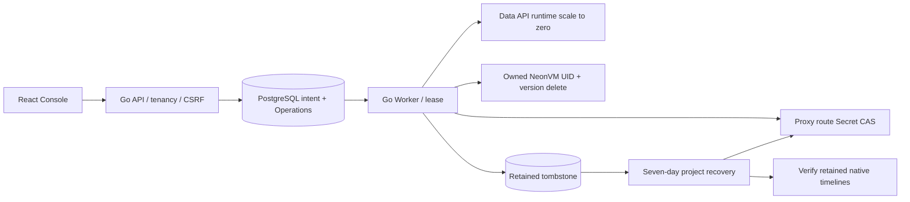

# 项目、分支保护与保留删除

## 1. 范围与官方语义

本实现提供 Go API/Worker、PostgreSQL 迁移 014、Console UI、依赖图、
幂等异步删除、Compute 回收、保留 tombstone 与七天项目恢复。
运行入口为 Console 的“保护与删除”和项目列表的“查看已删除项目”。

依据本项目保存的官方 website `c0d49cbb6979b2ce79ea502d62dbc40780a923b0`：

* [项目管理](https://neon.com/docs/manage/projects)：项目删除需要项目 Admin，
  删除后七天内可恢复。
* [分支管理](https://neon.com/docs/manage/branches)：删除分支关闭其数据库、角色和
  Compute；根分支及仍有子分支的分支不能单独删除。
* [保护分支](https://neon.com/docs/guides/protected-branches)：保护分支阻止分支删除，
  也阻止项目删除。

官网分支删除是永久操作。本版本不提供单独删除分支的恢复 API，但保留原始
Timeline/WAL/对象供后续安全 GC 和运维恢复开发，不能把它描述成已经完成物理清除。
项目恢复仅恢复该次项目删除时仍存活的资源，先前单独删除的分支继续关闭。
保留窗口截止也不会触发未经验证的物理 GC。

项目自身 `protected` 是额外防误操作保护；现有项目的默认保护不会自动解除。
修改保护需要 Admin、当前版本和准确名称确认。
这里没有实现官网保护分支的 IP Allow、自动子分支密码轮换或计划计费。

## 2. 架构与状态



删除：`ready → deleting → deleted`。API 在事务中关闭 metadata admission、
永久撤销本分支的应用 Backend 凭据、将 Data API 设置为 `disabling`；
异步关闭所有写/读 Compute 的 Proxy 入口，然后停用服务、回收 VM，最后写 tombstone。
删除确认意味着现有连接也会被 Compute 停止断开；调用方应先停止应用写入。

恢复：`deleted → recovering → ready`，再发布休眠路由。
原 Endpoint ID、Selector、数据库角色凭据和 Timeline 保持；实际 VM 保持 0，
下一次 SQL 由 Proxy 冷醒。Backend 凭据保持 revoked，Data API 保持 disabled，
需在恢复后的 UI 重新签发凭据、重新启用服务。
任何未实现且非 disabled 的 Backend 服务会阻止删除，不跳过其停用流程。

```mermaid
sequenceDiagram
  actor U as Admin / Editor
  participant A as Go API
  participant D as PostgreSQL
  participant W as Worker
  participant K as Kubernetes
  U->>A: DELETE + exact name + If-Match + Idempotency-Key
  A->>D: Lock project / dependency graph; validate protections and active Operations
  A->>D: Commit deleting intent and immutable operation scope
  A-->>U: 202 + existing Operation URL
  W->>D: Claim lease; validate durable scope and generation
  W->>K: CAS all scoped Proxy routes to deleted
  W->>K: Stop owned Data API runtimes
  W->>K: Delete owned VMs with UID + resourceVersion
  W->>K: Observe exact generation absence
  W->>D: Commit retained tombstone and deleted metadata
  U->>A: GET Operation (read retries only)
  A-->>U: succeeded / typed failure / retryable
```

## 3. 数据模型与并发约束

| 模型 | 新字段或作用 |
| --- | --- |
| projects | recover_until、deletion_operation_id；state、version、deleted_at |
| branches / endpoints | deletion_operation_id 绑定当前删除 generation |
| resource_tombstones | Operation、资源身份、纯 ID snapshot、七天期限、恢复标记、physical_gc_state=held |
| operations / operation_steps | 不含密码、Verifier 或 VM 模板；记录关闭入口、停用服务、回收 Compute、提交 tombstone |
| routes Secret | 保留已有角色及 VM 模板；state=deleted 拒绝冷醒；删除 generation 与恢复 Operation 标记 |

新工作和 failed→queued 重试必须经过 PostgreSQL parent lifecycle guard。
Delete 持有项目/分支锁，检查整个项目没有 queued/running/retry_wait 的 Operation；
通过后同事务写入删除意图。已删除分支不能通过旧创建/目录 Operation 重试复活。
唯一名称、组织项目及 Compute 配额在恢复事务中再次校验；冲突可人工排除再重试。

路由写入使用 resourceVersion；仅明确的 409 可以 CAS 重试。未知写入结果保留失败，
通过同一个 Operation 重试重新 GET 观察。VM 删除同时使用 UID 与 resourceVersion，
删除后出现新的 UID 视为失败，不删除不明后继 VM。
恢复必须先验证原 Timeline 仍存在，再提交 metadata，最后打开路由；不能在
配额或名称校验失败时提前开放 SQL。旧删除 Worker 不得再次关闭已恢复 generation。

跨进程 Proxy 连接账本与外部 epoch 栅栏仍是独立生产 Gate；本版本不得宣称 HA
或多实例删除/冷醒竞态已经生产认证。基础平台内部管理网络仍需可信 TLS Gate。

## 4. API 合同（OpenAPI 0.8.0）

所有 API 都有当前租户权限检查；Console 写入额外要求 CSRF。
项目删除、恢复及保护修改要求 Admin；叶分支删除要求 Editor 或 Admin。
已删除项目仅向有效 Admin 开放 lifecycle、Operation 观察与恢复；普通资源入口返回 404。

| 方法 | 路径 | 输入 / 输出 |
| --- | --- | --- |
| GET | /api/v1/projects/{project}/lifecycle | 项目、分支依赖图、tombstones、can_admin/can_edit、physical_gc_enabled=false |
| PATCH | /api/v1/projects/{project}/protection | If-Match；confirm_name、protected；200 新版本 |
| PATCH | /api/v1/projects/{project}/branches/{branch}/protection | 同上；必须属于该项目 |
| DELETE | /api/v1/projects/{project} | If-Match、Idempotency-Key；confirm_name；202 Resource + Operation |
| DELETE | /api/v1/projects/{project}/branches/{branch} | 同上；叶分支、非根、未保护 |
| POST | /api/v1/projects/{project}/recover | 同上；七天内已完成的项目删除 |
| GET | /api/v1/organizations/{org}/projects?deleted=true | 仅返回调用者具有有效 Admin 权限的已删除项目 |

版本头格式：`If-Match: "<version>"`。
缺少版本 428，版本冲突 412，名字确认失败 422，保护/子分支/运行操作/恢复期限冲突 409。
相同请求和 Idempotency-Key 返回同一 Operation；同 Key 不同输入返回 409。
`POST .../operations/{operation}/retry` 仅重试 durable scope，不创建另一删除请求。

## 5. 人工 UI 复测

只使用新建的专用测试项目。记录 IDs、镜像 digest、源码 SHA 和每次 Operation。

1. 创建项目，选择 1 CPU / 1 GiB；SQL 工作台建立表并写入标记，缩到 0。
2. 创建不带 Compute 的 parent 分支，再从 parent 创建 leaf。
3. “保护与删除”检查 root 与 parent 不能删除；开启/解除 leaf 保护需要准确名称。
4. 给 leaf 创建最小 Compute，SQL 验证继承。删除 leaf，等待所有四步成功；
   检查 Endpoint 不再可访问、VM/Runner 已消失、tombstone 的 GC 保持 held。
5. 删除 parent；准确输入项目与 main 名称，分别解除其保护。
6. 为 main 添加两个只读 Compute，各自 1 CPU / 1 GiB、独立 Endpoint Selector。
   使用主节点角色密码，检查 `pg_is_in_recovery()` 为 true、
   `transaction_read_only` 为 on，尝试写入应得到 `422/sql_failed`。
   分别缩到 0；主节点写入第二个标记，再通过各自 SQL 入口冷醒，验证 WAL 数据可见。
   一个 Reader 的缩零不能改变另一个 Endpoint 的身份或状态。
7. 保持一个 Reader 和主节点运行，删除项目；正常入口不可用，回收全部 Compute。
8. 项目列表“查看已删除项目”进入该项目；确认七天期限，点击恢复并准确输入名称。
9. 原 Writer 和两个 Reader 都保持休眠，各自通过原 Proxy 凭据冷醒，两个标记都在。
10. 先前删除的 parent/leaf 不恢复；操作记录和 tombstone 保留。
11. 测试完将恢复的全部 Compute 缩到 0；保留全部记录、数据库、对象、WAL、Secrets。
12. 追加服务生命周期：按 DATA-API-NATIVE-DRIVER.md 准备真实 RLS 表，从 UI 启用
    Data API 并查询标记，再签发一次性 Backend 凭据。保持服务运行时删除项目，
    检查其 Deployment 缩到 0、公开 Data API 返回 404、Compute 回收。
    恢复后 Data API 仍 disabled、旧 Backend Token 返回 401且显示“已撤销”；
    显式重新启用 Data API，原 RLS 数据可读。最终正常停用服务并缩到 0。

自动化：`web/e2e/lifecycle.spec.ts`，按 TESTING.md 的 Linux 显式 live 参数执行。
Go 的 deletion_integration_test 使用隔离真实 PostgreSQL 与模拟 Kube/存储 peer；
这些故障注入结果不能替代真实 Linux UI 的 native storage 验证。
本 suite 的 Reader 验收覆盖手动休眠和 SQL 冷醒；两个 Reader 的自动 idle、
长事务、热点负载和多实例冷醒竞争仍在独立伸缩矩阵中，不由这些断言代替。

## 6. 后续 Gate

物理 GC、滞留服务/失败创建资源删除、TTL 分支自动过期、独立 Endpoint 删除、
多实例连接账本、长事务/冷醒/控制器故障完整矩阵，以及所有未来 Backend Driver
的协调删除仍须独立开发和验收。当前受保护数据保留约束阻止启用破坏性的 purge。
