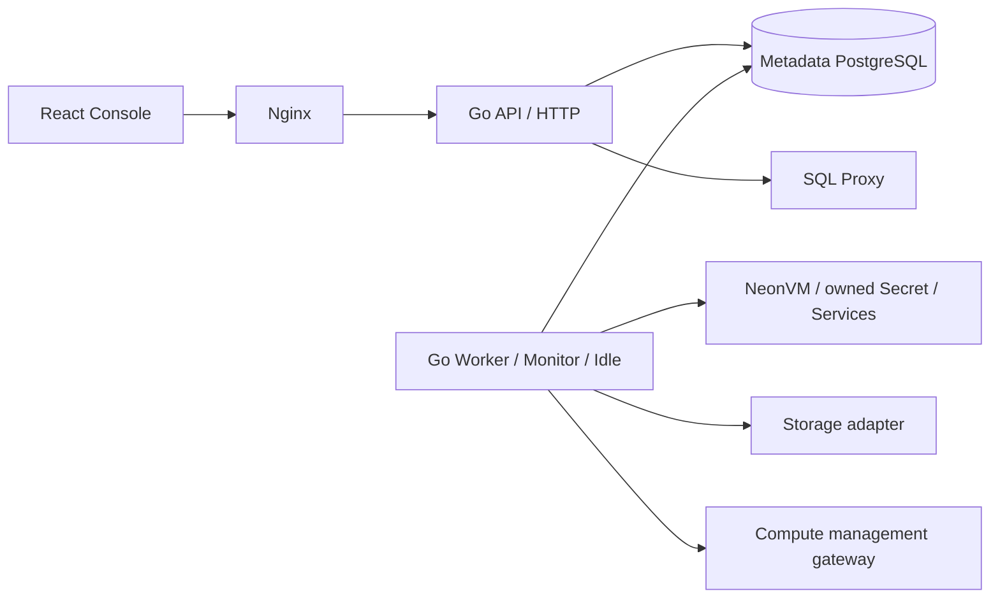

# API / Worker 独立进程与升级

## 1. 实现边界

Chart 0.3.0 默认启动独立 API、Worker、Web 三个 Deployment。
API 与 Worker 使用同一个固定 digest 的 API 镜像，分别运行
`control-api` 与 `control-worker`，避免调谐协议版本漂移。
API 保留同步 SQL/连接管理路径；没有完整连接 fencing 前，仍限制一个 API。
Worker/Monitor/Idle/Sessions cleanup 只在控制器领导进程中运行。
一个 Worker 为当前允许的部署配置，多 Worker 的现场 HA 尚未放行。



| 进程 | 角色 | HTTP | 数据库连接 |
| --- | --- | --- | --- |
| control-api | `NEON_CONTROL_PROCESS_ROLE=api` | 8788，57 个控制操作及独立数据入口 | 意图、授权、读取、SQL guard |
| control-worker | worker，入口固定 | 8789，仅 healthz / readyz | 调谐与专属 leadership session |
| 显式兼容 profile | all | 8788 | 原合并功能 + 新领导租约 |

Worker 不 bootstrap admin、不导入 lab seed、不注册控制 API；其文件卷只挂载幂等密钥。
两个 ServiceAccount 独立，当前共享 namespace Role。进一步收敛动态 Secret 权限
需要 admission/ownership 策略，不能宣称已有完整资源级 RBAC。

## 2. 租约与退出

专用 PostgreSQL connection 持有 session advisory lock `794210027`。
只有持锁者写入 `control_runtime_leases` 并启动控制器组；候选 Worker 保持 standby。
API 角色禁止取得此锁。合并模式发现另一领导者则退出，避免并行合并实例。
一套 metadata database 对应一套控制器组，不能共用 DB 承载互不相关集群。

新领导者增加持久 epoch；每 2 秒有界续约，心跳有效期 10 秒。
连接丢失、续约超时或 owner/epoch 不匹配会立即取消控制器 context、撤销 readiness、
最多等待 12 秒排空，然后退出。归还 pool 前关闭持锁物理 connection，
不把带 advisory lock 的连接交给其他请求。关闭时只过期自己的 owner/epoch。

```mermaid
sequenceDiagram
  participant W1 as Worker 1
  participant DB as Metadata PG
  participant W2 as Candidate
  W1->>DB: pg_try_advisory_lock + owner / epoch
  DB-->>W1: acquired
  W2->>DB: pg_try_advisory_lock
  DB-->>W2: false; standby
  loop heartbeat
    W1->>DB: renew exact owner / epoch
  end
  DB--xW1: connection lost
  W1->>W1: cancel / not ready / bounded drain / exit
  W2->>DB: acquire new session; epoch + 1
  W2->>W2: start controllers
```

此机制是协作式领导选举。它不能撤销已经发往 Proxy/Compute 的旧外部请求，
不能替代跨实例缩零栅栏、短连接账本、Metadata HA 或独立故障域验收。

## 3. 从旧合并版本升级

旧发行未持有领导锁，因此必须停止旧控制器再创建新 Worker。
**不能直接对仍运行的旧合并发行执行默认 split profile 的 helm upgrade。**

1. 准备新镜像：其中必须实际包含 control-worker；旧 e4fd1f3 发行没有此二进制。
2. 保留 Helm history/values、metadata DB 与所有原 Secrets；保持 HMAC 不变。
   切换前使用受保护目录保存 metadata 的 pg_dump 自定义格式备份及 SHA256，
   验证备份成功后才停止旧进程；备份包含身份信息，不上传公共 Git 或 CI artifact。
3. 停止提交新的控制变更，确认无 queued/running/retry_wait Operation。
4. 缩到 0 并确认旧 API Pod 完全退出：

```bash
kubectl -n neon scale deployment/neon-control-api --replicas=0
kubectl -n neon wait --for=delete pod \
  -l app.kubernetes.io/instance=neon-control-plane,app.kubernetes.io/component=api \
  --timeout=120s
```

5. 若来源已经有 Worker，先同样停止 Worker 并等待 Pod 退出。
6. 使用与新源码匹配的固定 API/Web digest 和原私密 values：

```bash
helm upgrade neon-control-plane charts/neon-control-plane -n neon \
  --reset-values -f /secure/neon-control/values.yaml \
  --set worker.enabled=true --wait --timeout 10m
kubectl -n neon rollout status deployment/neon-control-worker --timeout=300s
kubectl -n neon rollout status deployment/neon-control-api --timeout=300s
```

7. 查 Worker ready、API ready、runtime heartbeat；确认仅一组控制器活动。
8. 浏览器登录，原生创建项目/分支/Endpoint、Proxy SQL、休眠/冷醒和监控。
9. 验证 Worker 离线时 API 仍可接受持久 Operation；恢复后原 ID 调谐成功。
10. 测试完成后正常 suspend Computes，保留证据、数据及私密重建资料。

metadata migration 009 为 additive forward migration；之前的 001–008 保持不变。
备份/恢复需包含新表。旧版本回滚仍须先验证 schema 兼容。

## 4. 回滚

切换回 all 或旧无锁版本之前，必须先停止 Worker 与 API，确认旧 Pod 都消失。
然后执行匹配目标发行的 Helm rollback。不能假定 Helm 自动资源操作顺序具有栅栏。
不要重建 metadata DB 或 Secret。恢复后验证原数据、角色、分支和连接能力。

## 5. 合同与验收

`GET /api/v1/capabilities.runtime` 是原 API 的 additive 字段：
process_role、separated、controller_status、可选 epoch/last_heartbeat_at。
状态读取错误返回 unavailable；过期心跳返回 stale，不伪造 healthy。
监控页面每 15 秒更新；不会因读取 Worker 状态唤醒 Compute。

Go 真实 PG 测试覆盖互斥、takeover、epoch、终止专用连接、旧代次续约/关闭拒绝。
Helm 覆盖 split/combined 渲染、拒绝多个 API/Worker、固定 digest 与 CA。
现场必须另外验证真实进程分离、故障期间的 UI/Operation、恢复与基础设施稳定性。
测试数据库必须独立于运行 metadata DB；session lock 以 database 为边界。

### 5.1 真实 Worker 故障 UI 用例

`web/e2e/native-product.spec.ts` 支持以下额外环境变量：

| 变量 | 含义 |
| --- | --- |
| NEON_E2E_EXPECT_SPLIT=true | 检查登录后 API role=api、separated=true 和监控的 Worker 心跳 |
| NEON_E2E_WORKER_FAULT=true | 首次 UI 创建必须 queued；写入私密目录的 worker-queue-ready.json，等待外部运维恢复 Worker |

该模式需要独占维护窗口。先确认无 active Operation，再缩 `neon-control-worker`
到 0 并等 Pod 完全退出，API/Web 保持运行。用唯一、权限 0700 的私密目录启动
Linux 浏览器测试；测试在真实 UI 创建后检查 Operation state=queued。
只有出现本次目录中的 marker，外部运维才把同一 Worker Deployment 恢复为 1。
浏览器等待原 Operation 完成，再继续真实 SQL、分支隔离、休眠和冷唤醒验证。
记录前后 Worker Pod UID、metadata epoch 与原 Operation ID；epoch 必须增加。
运维脚本须有 finally/trap：测试或 SSH 失败也恢复原副本数，保留失败、日志和 fixture。
不要把集群管理凭据挂入浏览器容器。不能用数据库直接改 Operation 状态代替恢复。

2026-10-04 Linux 现场已通过上述用例：Worker epoch 2→3，原 queued Operation
由新 Worker 完成；12 个浏览器检查事件通过，两台受测 Compute 最终正常休眠。
146 个 Go 测试事件（含子测试）零跳过；TypeScript 和 Helm split/combined 门槛通过。
该证据只放行本次进程拆分与受测恢复路径，不放行多 API、HA/DR 或外部缩零栅栏。


### 5.2 PostgreSQL 会话锁释放的测试同步

客户端 `pgx` 关闭连接或 `pg_terminate_backend` 返回，并不保证另一个会话立刻
观察到 advisory lock 已释放。生产 Worker 对 `pg_try_advisory_lock=false`
保持 standby，按现有有界循环重试。集成测试也应观察服务端状态后验证交接；
不能要求客户端 close 的返回时刻就同步完成新 lease。

`TestControllerLeadershipIntegration` 记录前任 PostgreSQL PID，等待 `pg_locks`
中该会话的 advisory lock 消失，最多五秒，再验证 successor epoch、旧心跳拒绝、
失联接管和旧 generation 关闭保护。该等待只存在于测试，不改变运行时超时、
租约、互斥、外部栅栏或 HA 门槛。等待超时仍失败，不能用无限重试掩盖遗留锁。

2026-10-08 最后文档提交的 CI `37797382865` 曾在即时 takeover 断言失败。
原日志和测试 JSON 保留；此前功能 CI 与现场 Worker epoch 67→68、71→72
确已通过。此次纠正测试的服务端同步，不修改 Neon 数据面或生产 Worker。
复测应在独立临时 PostgreSQL 中使用每轮新 schema，禁止运行于产品元数据库。


修正后的 Linux 全量 Go/race/vet 测试 354 项通过、零失败/跳过；另在同一独立
临时 PG 上用十个新 schema 连续复测交接，共 60 个检查通过。复测示例：

```bash
# 只使用专用、可丢弃的 CI PostgreSQL；不得指向任何产品元数据库。
set -euo pipefail
: "${NEON_V2_TEST_DATABASE_URL:?Dedicated disposable PostgreSQL required}"
cd api
task_attempt="$(date -u +%Y%m%d%H%M%S)"
task_evidence="../artifacts/leadership-$task_attempt"
mkdir -m 0700 "$task_evidence"
for task_iteration in $(seq 1 10); do
  export NEON_V2_TEST_SCHEMA="v2_migration_handoff_${task_attempt}_${task_iteration}"
  go test -race -count=1 -run '^TestControllerLeadershipIntegration$' \
    -json ./internal/control > "$task_evidence/$task_iteration.jsonl"
done
```

每轮 schema 均不同；保留原失败和 JSON 结果，失败时停止后续轮次。
源协议依据为锁定的 `pgx v5.9.2` 的 `pgconn.Close` 与 PostgreSQL 会话锁状态。
